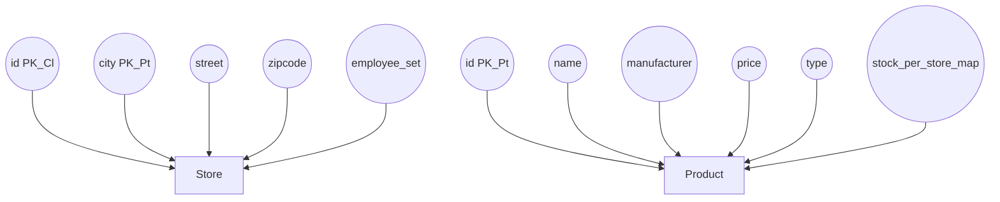
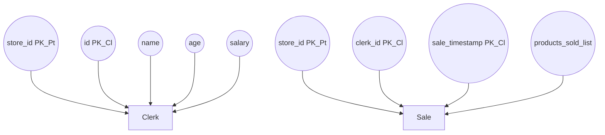


# Prática CBD - 3

# Index
- [Initial Configurations](#initial-configurations)
- [Initial Cassandra Interactions](#initial-cassandra-interactions)
- [Cassandra - Video Sharing System](#cassandra-video-sharing-system)
- [Cassandra Driver](#cassandra-driver)
- [Free Theme DB - Shop Stock and Sales](#free-theme-db-shop-stock-and-sales)

# Initial Configurations
Checkout http://cassandra.apache.org/download/

Note:
An issue kept ocurring during the installation problem where Cassandra wouldn't be able to start due to permission errors. 
This was fixed by:
1. First running Cassandra in sudo (which is not recommended)
	```
	$sudo cassandra -f -R
	```
2. Then inputting the following commands:
	```
	$sudo chown -R $USER:$GROUP /var/lib/cassandra
	$sudo chown -R $USER:$GROUP /var/log/cassandra
	```

Alternatively, instead of running Cassandra in sudo on the first time, you could just create the folders manually:
```
sudo mkdir /var/lib/cassandra
sudo mkdir /var/log/cassandra
```

### Starting Cassandra
``` 
$ cassandra -f
```
### Stopping Cassandra
``` 
$ sudo service cassandra stop
```
### Verify that Cassandra is working
``` 
$ nodetool status
```
### Booting up the Cassandra shell ( ͡° ͜ʖ ͡°) 
``` 
$ cqlsh
```

# Initial Cassandra Interactions
For more information visit https://www.tutorialspoint.com/cassandra/cassandra_introduction.htm

## Data Model
### Cluster

> The Cassandra database is distributed over several machines that operate together. The outermost container is known as the Cluster. For failure handling, every node contains a replica, and in case of a failure, the replica takes charge. Cassandra arranges the nodes in a cluster, in a ring format, and assigns data to them.

### Keyspace

> Keyspace is the outermost container for data in Cassandra. The basic attributes of a Keyspace in Cassandra are:
>
> -   **Replication factor** − It is the number of machines in the cluster that will receive copies of the same data.
>    
>-   **Replica placement strategy** − It is nothing but the strategy to place replicas in the ring. We have strategies such as **simple strategy** (rack-aware strategy), **old network topology strategy** (rack-aware strategy), and **network topology strategy** (datacenter-shared strategy).
>    
>-   **Column families** − Keyspace is a container for a list of one or more column families. A column family, in turn, is a container of a collection of rows. Each row contains ordered columns. Column families represent the structure of your data. Each keyspace has at least one and often many column families.


### Column Family

> A column family is a container for an ordered collection of rows. Each row, in turn, is an ordered collection of columns. The following table lists the points that differentiate a column family from a table of relational databases.
> 
> Note that unlike relational tables where a column family’s schema is not fixed, Cassandra does not force individual rows to have all the columns.
> 
> A Cassandra column family has the following attributes:
>
>-   **keys_cached** − It represents the number of locations to keep cached per SSTable.
  >  
>-   **rows_cached** − It represents the number of rows whose entire contents will be cached in memory.
>    
>-   **preload_row_cache** − It specifies whether you want to pre-populate the row cache.


### Column

> A column is the basic data structure of Cassandra with three values, namely key or column name, value, and a time stamp. Given below is the structure of a column.


## Cassandra vs Relational DBs


## Cassandra's Native Data Types


## Some Commands

### Keyspace:
#### Creating, Listing and Switching to a Keyspace
This command is used to create and switch to a new DB

Syntax:
```
CREATE KEYSPACE <identifier> WITH <properties>
```
The < properties > tag includes: 
-	**replication**
	-	Specifies the amount of replicas wanted and the Replica Placement Strategy
-	**durable_writes**
	-	Set to True by default

Usage:
```
CREATE KEYSPACE KeySpace Name
WITH replication = {'class': ‘Strategy name’, 'replication_factor' : ‘No.Of  replicas’}

AND durable_writes = true/false
```

Example:
```
cqlsh> CREATE KEYSPACE cbd_tutorial
   ... WITH replication = {'class': 'SimpleStrategy', 'replication_factor': 3};


cqlsh> DESCRIBE keyspaces;

system_schema  system              system_traces
system_auth    system_distributed  cbd_tutorial 


cqlsh> USE cbd_tutorial;
cqlsh:cbd_tutorial> 
```
Note the use of :
-	`DESCRIBE keyspaces`
	-	In order to list all of the existing keyspaces.
-	`USE cbd_tutorial` 
	-	In order to switch to our newly created Keyspace


#### Altering a Keyspace
This command is used to alter the properties of a Keyspace

Syntax:
```
ALTER KEYSPACE <identifier> WITH <properties>
```

Usage:
```
ALTER KEYSPACE KeySpace_Name
WITH replication = {'class': ‘Strategy name’, 'replication_factor' : ‘No.Of  replicas’};
AND DURABLE_WRITES = true/false;
```

Example:
```
cqlsh:cbd_tutorial> ALTER KEYSPACE cbd_tutorial WITH replication = {'class': 'SimpleStrategy', 'replication_factor': 5};
```

#### Dropping a Keyspace
This command is used to drop a Keyspace

Syntax:
```
DROP KEYSPACE <identifier>
```

Usage:
```
DROP KEYSPACE KeySpace_name
```

Example:
```
cqlsh> DROP KEYSPACE cbd_tutorial;

cqlsh> DESCRIBE keyspaces;

system_schema  system_auth  system  system_distributed  system_traces
```

### Column Family and Column:
#### Creating a Column Family and Defining a Column
This command is used to insert a new Column Family (also referred to as Table) to the current Keyspace

Syntax - Create a Column Family:
```
CREATE (TABLE | COLUMNFAMILY) <tablename>
('<column-definition>' , '<column-definition>')
(WITH <option> AND <option>)
```

Note how we have to define our columns. This can be done with the following command:

Syntax - Define Columns:
```
name1 data_type,
name2 data_type,
...
nameN data_type PRIMARY KEY
```

Note the use of **Primary Key**:
> The primary key is a column that is used to uniquely identify a row. Therefore,defining a primary key is mandatory while creating a table. A primary key is made of one or more columns of a table.

There are some particularities to Cassandra's Primary Key that are worth pointing out:
-	The Key is composed off of 2 Sub-Keys:
	-	**Partitioning Key**
		-	Obligatory
		-	Used to specify how table rows are distributed among partitions
	-	**Clustering Key**
		-	Optional
		-	Defines the clustering order, i.e. how table rows are locally stored within a partition
		-	


Usage:
```
CREATE COLUMNFAMILY / TABLE tablename(
   column1 name datatype PRIMARYKEY,
   column2 name data type,
   column3 name data type.
)

or

CREATE COLUMNFAMILY / TABLE tablename(
   column1 name datatype,
   column2 name data type,
   column3 name data type,
   PRIMARY KEY (column1)
)
```

Example:
```
cqlsh:cbd_tutorial> CREATE COLUMNFAMILY player(
                ... player_id int PRIMARY KEY,
                ... player_name text,
                ... player_age int,
                ... player_rank int
                ... );
                
cqlsh:cbd_tutorial> select * from players;

 player_id | player_age | player_name | player_rank
-----------+------------+-------------+-------------

(0 rows)
```
Note the use of :
-	`select * from players`
	-	A query used to list all rows from a given column family

#### Altering a Column Family
This command is used to alter a given Column Family, either by **ADDING** or **DROPPING** columns

Syntax:
```
ALTER (TABLE | COLUMNFAMILY) <tablename> <instruction>
```

Usage:
```
ALTER COLUMNFAMILY / TABLE table_name
ADD  new_column datatype;

ALTER COLUMNFAMILY / TABLE table_name
DROP column_name;
```

Example:
```
cqlsh:cbd_tutorial> ALTER TABLE player
                ... DROP player_rank;
cqlsh:cbd_tutorial> ALTER COLUMNFAMILY player
                ... ADD player_score double;
cqlsh:cbd_tutorial> SELECT * FROM player;

 player_id | player_age | player_name | player_score
-----------+------------+-------------+--------------

(0 rows)
```


#### Dropping a Column Family
This command can be used to Drop a Column Family

Syntax:
```
DROP TABLE|COLUMNFAMILY <tablename>
```

Usage:
```
DROP COLUMNFAMILY/TABLE table_name;
```

Example:
```
cqlsh:cbd_tutorial> DROP COLUMNFAMILY player;

cqlsh:cbd_tutorial> DESCRIBE COLUMNFAMILIES;

<empty>
```

#### Truncating a Column Family
Using this command will delete all rows  from a given Column Family PERMANENTLY!

Syntax:
```
TRUNCATE <tablename>
```

Usage:
```
TRUNCATE table_name;
```

Example:
```
cqlsh:cbd_tutorial> TRUNCATE player;

cqlsh:cbd_tutorial> SELECT * from player;

 player_id | player_age | player_name | player_score
-----------+------------+-------------+--------------

(0 rows)

```

### CRUD Operations
#### CREATING Data 
The following command allows for the insertion of data into the columns of a row in a Column Family

Syntax:
```
INSERT INTO <tablename>
(<column1 name>, <column2 name>....)
VALUES (<value1>, <value2>....)
USING <option>
```

Example:
```
cqlsh:cbd_tutorial> SELECT * from player;

 player_id | player_age | player_name | player_score
-----------+------------+-------------+--------------

(0 rows)

cqlsh:cbd_tutorial> INSERT INTO player (player_id, player_age, player_name, player_score)
                ... VALUES (1, 20, 'DS', 69);
cqlsh:cbd_tutorial> INSERT INTO player (player_id, player_name, player_score)
                ... VALUES (2, 'Chico Ace', 80.420);
cqlsh:cbd_tutorial> INSERT INTO player (player_id, player_name)
                ... VALUES (3, 'Açores');
                
cqlsh:cbd_tutorial> SELECT * FROM player;

 player_id | player_age | player_name | player_score
-----------+------------+-------------+--------------
         1 |         20 |          DS |           69
         2 |       null |   Chico Ace |        80.42
         3 |       null |      Açores |         null

(3 rows)
```

#### UPDATING Data 
The following command allows you to update data in a Column Family

Syntax:
```
UPDATE <tablename>
SET <column name> = <new value>
<column name> = <value>....
WHERE <condition>
```
Where:
-	**SET**:
	-	The name of the column we want to alter and it's new value
-	**WHERE**:
	-	Used to select the specific row to be modified

Example:
```
cqlsh:cbd_tutorial> SELECT * FROM player;

 player_id | player_age | player_name | player_score
-----------+------------+-------------+--------------
         1 |         20 |          DS |           69
         2 |       null |   Chico Ace |        80.42
         3 |       null |      Açores |         null

(3 rows)

cqlsh:cbd_tutorial> UPDATE player
                ... SET player_score = 100.01
                ... WHERE player_id = 3;

cqlsh:cbd_tutorial> UPDATE player
                ... SET player_age = 19
                ... WHERE player_name = 'Chico Ace';
InvalidRequest: Error from server: code=2200 [Invalid query] message="Some partition key parts are missing: player_id"

cqlsh:cbd_tutorial> UPDATE player
                ... SET player_age = 19
                ... WHERE player_id = 2 AND player_name = 'Chico Ace';
InvalidRequest: Error from server: code=2200 [Invalid query] message="Non PRIMARY KEY columns found in where clause: player_name "

cqlsh:cbd_tutorial> SELECT * FROM player;

 player_id | player_age | player_name | player_score
-----------+------------+-------------+--------------
         1 |         20 |          DS |           69
         2 |       null |   Chico Ace |        80.42
         3 |       null |      Açores |       100.01

(3 rows)
```
Note the errors present when we try to update without using the primary key!

This is because the **WHERE clause has some constrictions** that stem from the fact that Cassandra is
dealing with distributed data and aims to prevent inefficient queries:
- rows are spread around the cluster based on the hash of
the partition keys
- clustering key columns are used to cluster the data of a
partition, allowing a very efficient retrieval of rows

These restrictions include:


And some examples of valid and invalid WHERE clauses are: 


#### DELETING a ROW 
The following command allows you to delete a row from a Column Family

Syntax:
```
DELETE FROM <identifier> WHERE <condition>;
```

Example:
```
cqlsh:cbd_tutorial> SELECT * FROM player;

 player_id | player_age | player_name | player_score
-----------+------------+-------------+--------------
         1 |         20 |          DS |           69
         2 |       null |   Chico Ace |        80.42
         3 |       null |      Açores |       100.01

(3 rows)

cqlsh:cbd_tutorial> DELETE FROM player
                ... WHERE player_id = 3;

cqlsh:cbd_tutorial> SELECT * FROM player;

 player_id | player_age | player_name | player_score
-----------+------------+-------------+--------------
         1 |         20 |          DS |           69
         2 |       null |   Chico Ace |        80.42

(2 rows)
```

#### DELETING a COLUMN 
The following command allows you to delete a column from a specific row in a Column Family

Syntax:
```
DELETE <col> FROM <identifier> WHERE <condition>;
```

Example:
```
cqlsh:cbd_tutorial> SELECT * FROM player;

 player_id | player_age | player_name | player_score
-----------+------------+-------------+--------------
         1 |         20 |          DS |           69
         2 |       null |   Chico Ace |        80.42

(2 rows)

cqlsh:cbd_tutorial> DELETE player_score FROM player WHERE player_id = 2;

cqlsh:cbd_tutorial> SELECT * FROM player;

 player_id | player_age | player_name | player_score
-----------+------------+-------------+--------------
         1 |         20 |          DS |           69
         2 |       null |   Chico Ace |         null

(2 rows)
```


#### READING  Data  
The following command allows you to read data from a Column Family

Syntax:
```
SELECT * | select_expression | DISTINCT partition 
FROM [keyspace_name.] table_name 
[WHERE partition_value
   [AND clustering_filters 
   [AND static_filters]]] 
[ORDER BY PK_column_name ASC|DESC] 
[LIMIT N]
[ALLOW FILTERING]
```
There are also extra clauses we can use with the SELECT:
-	**WHERE**:
	-	Used to specify conditionals of the data we want to gather
-	**GROUP BY**:
	-	Groups rows of a table according to certain columns
	-	Only groupings induced by primary key columns are allowed!
	-	When a non-grouping column is selected without an aggregate function the first value encountered is the only one returned
-	**ORDER BY**:
	-	Defines the order of the returned rows
	-	Can be ASC or DESC
	-	Partition key must be restricted (= or IN)
	-	Only orderings induced by clustering columns are allowed!
-	**LIMIT**:
	-	Limits the numbers of rows returned in the query result

Example:
```
cqlsh:cbd_tutorial> SELECT * FROM player;

 player_id | player_age | player_name | player_score
-----------+------------+-------------+--------------
         1 |         20 |          DS |           69
         2 |       null |   Chico Ace |         null

(2 rows)
cqlsh:cbd_tutorial> SELECT player_name FROM player;

 player_name
-------------
          DS
   Chico Ace

(2 rows)

cqlsh:cbd_tutorial> SELECT player_name FROM player
                ... LIMIT 1;

 player_name
-------------
          DS

(1 rows)

cqlsh:cbd_tutorial> SELECT player_name FROM player 
                ... WHERE player_id = 2;

 player_name
-------------
   Chico Ace

(1 rows)

cqlsh:cbd_tutorial> SELECT player_name FROM player  WHERE player_age > 10;
InvalidRequest: Error from server: code=2200 [Invalid query] message="Cannot execute this query as it might involve data filtering and thus may have unpredictable performance. If you want to execute this query despite the performance unpredictability, use ALLOW FILTERING"

cqlsh:cbd_tutorial> SELECT player_name FROM player  WHERE player_age > 10 ALLOW FILTERING;

 player_name
-------------
          DS

(1 rows)

cqlsh:cbd_tutorial> SELECT player_name FROM player  ORDER BY player_id DESC;
InvalidRequest: Error from server: code=2200 [Invalid query] message="ORDER BY is only supported when the partition key is restricted by an EQ or an IN."
```

Note the errors in the following queries:
-	`SELECT player_name FROM player  WHERE player_age > 10;`
	-	Happens due to the fact that player_age ISN'T part of the primary key
-	`SELECT player_name FROM player  ORDER BY player_id DESC;`
	-	Happens due to the fact that player_id isn't part of the Clustering Key (it's part of the Partitioning Key)

Also note how in `SELECT player_name FROM player  WHERE player_age > 10 ALLOW FILTERING;` only one row is returned despite both rows fulfilling our WHERE CONDITION.  This is due to the fact that player_age isn't a grouping attribute


# Cassandra - Video Sharing System

Notes: 
-	PK
	-	Primary Key
-	PT
	-	Partitioning Key
-	Cl
	-	Clustering Key
	
```mermaid
graph TB
A[User]
A_attrib_1((email PK_Pt)) --> A
A_attrib_2((username)) --> A
A_attrib_3((reg_timestamp)) --> A
A_attrib_4((name)) --> A

B[Video]
B_attrib_1((id PK_Pt)) --> B
B_attrib_2((author PK_Cl_1)) --> B
B_attrib_3((upload_timestamp PK_Cl_2)) --> B
B_attrib_4((name)) --> B
B_attrib_5((description)) --> B
B_attrib_6((Tags)) --> B
B ==Was posted by ==> A

C[Comment]
C_attrib_1((id PK_Pt_1)) --> C
C_attrib_2((video_id PK_PT_2)) --> C
C_attrib_3((author PK_PT_3)) --> C
C_attrib_4((comment)) --> C
C_attrib_5((upload_timestamp PK_Cl_1)) --> C

C ==Was posted in==> B
C ==Was posted by==> A

D[Followers]
D_attrib_1((user Pk_Pt_1)) --> D
D_attrib_2((video_id Pk_Pt_2)) --> D
D ==Has Several==> A
D ==Pertrains to==> B

E[Event]
E_attrib_1((id PK_Pt)) --> E
E_attrib_2((user PK_Cl_1)) --> E
E_attrib_3((video PK_Cl_2)) --> E
E_attrib_4((action)) --> E
E_attrib_5((real_timestamp)) --> E
E_attrib_6((video_timestamp)) --> E
E ==Has a==> A
E ==Refers to a==> B

F[Rating]
F_attrib_1((id PK_Pt)) --> F
F_attrib_2((video PK_Cl_1)) --> F
F_attrib_3((value)) --> F
F ==Pertrains to==> B
```


## DB Creation
### Step 1 - Create Keyspace
```
cqlsh> CREATE KEYSPACE cbd_video_sharing_melhor WITH replication = {'class': 'SimpleStrategy', 'replication_factor': 3};
cqlsh> USE cbd_video_sharing_melhor ;
cqlsh:cbd_video_sharing_melhor> 
```

### Step 2 - Create Column Families
```
#USER
cqlsh:cbd_video_sharing_melhor> CREATE COLUMNFAMILY Users (email text, username text, name text, reg_timestamp timestamp, Primary Key(email));


#VIDEOS
cqlsh:cbd_video_sharing_melhor> CREATE COLUMNFAMILY Videos(id int, author text, title text, upload_timestamp timestamp, description text, tags list<text>, Primary Key(id, upload_timestamp)) WITH CLUSTERING ORDER BY (upload_timestamp DESC);


#VIDEOS PER TAG
cqlsh:cbd_video_sharing_melhor> CREATE COLUMNFAMILY Videos_per_tag(tag text, video_ids list<int>, PRIMARY KEY(tag));

#VIDEOS PER TAG 2
cqlsh:cbd_video_sharing_melhor> CREATE COLUMNFAMILY Videos_tags(tag text, video_id int, Primary Key(tag,video_id));

#VIDEOS PER AUTHOR
cqlsh:cbd_video_sharing_melhor> CREATE COLUMNFAMILY Videos_per_author(user_email text, author text, video_id int, upload_timestamp timestamp, PRIMARY KEY(user_email, upload_timestamp, video_id));


#COMMENTS PER USERNAME
cqlsh:cbd_video_sharing_melhor> CREATE TABLE Comments_per_username(user_email text, user_username text, video_id int, comment text, upload_timestamp timestamp, PRIMARY KEY (user_username, upload_timestamp)) WITH CLUSTERING ORDER BY (upload_timestamp DESC);


#COMMENTS PER VIDEO
cqlsh:cbd_video_sharing_melhor> CREATE TABLE Comments_per_video(video_id int, user_email text, user_username text, comment text, upload_timestamp timestamp, PRIMARY KEY(video_id, upload_timestamp)) WITH CLUSTERING ORDER BY (upload_timestamp DESC);


#FOLLOWERS PER VIDEO
cqlsh:cbd_video_sharing_melhor> CREATE COLUMNFAMILY Followers_per_video(video_id int, user_email text, PRIMARY KEY(video_id, user_email));


#VIDEOS FOLLOWED PER USER
cqlsh:cbd_video_sharing_melhor> CREATE COLUMNFAMILY Followed_videos_per_author(video_ids list<int>, user_email text, PRIMARY KEY(user_email));


#EVENTS PER AUTHOR PER VIDEO                     
cqlsh:cbd_video_sharing_melhor> CREATE COLUMNFAMILY Events_per_author_in_video(user_email text, video_id int, action text, real_timestamp timestamp, video_timestamp int, PRIMARY KEY((user_email, video_id), real_timestamp, video_timestamp)) WITH CLUSTERING ORDER BY (real_timestamp DESC);


#RATINGS PER VIDEO      
cqlsh:cbd_video_sharing_melhor> CREATE COLUMNFAMILY Ratings_per_video(review_id int, video_id int, value int, PRIMARY KEY(video_id, value,review_id));
```

### Step 3 - Populating the Column Families
#### User
```
cqlsh:cbd_video_sharing_melhor> SELECT * FROM Users;

 email | name | reg_timestamp | username
-------+------+---------------+----------

(0 rows)

cqlsh:cbd_video_sharing_melhor> INSERT INTO Users (email, name, reg_timestamp, username) VALUES ('ds@test.com', 'DS', dateof(now()), 'FenixDS');

cqlsh:cbd_video_sharing_melhor> INSERT INTO Users (email, name, reg_timestamp, username) VALUES ('user1@bot.com', 'Bot1', dateof(now()), 'Tester1');

cqlsh:cbd_video_sharing_melhor> INSERT INTO Users (email, name, reg_timestamp, username) VALUES ('user2@bot.com', 'Bot2', dateof(now()), 'Tester2');

cqlsh:cbd_video_sharing_melhor> INSERT INTO Users (email, name, reg_timestamp, username) VALUES ('user3@bot.com', 'Bot3', dateof(now()), 'Tester3');

cqlsh:cbd_video_sharing_melhor> INSERT INTO Users (email, name, reg_timestamp, username) VALUES ('user4@bot.com', 'Bot4', dateof(now()), 'Tester4');

cqlsh:cbd_video_sharing_melhor> INSERT INTO Users (email, name, reg_timestamp, username) VALUES ('user5@bot.com', 'Bot5', dateof(now()), 'Tester5');

cqlsh:cbd_video_sharing_melhor> INSERT INTO Users (email, name, reg_timestamp, username) VALUES ('user6@bot.com', 'Bot6', dateof(now()), 'Tester6');

cqlsh:cbd_video_sharing_melhor> INSERT INTO Users (email, name, reg_timestamp, username) VALUES ('user7@bot.com', 'Bot7', dateof(now()), 'Tester7');

cqlsh:cbd_video_sharing_melhor> INSERT INTO Users (email, name, reg_timestamp, username) VALUES ('user8@bot.com', 'Bot8', dateof(now()), 'Tester8');

cqlsh:cbd_video_sharing_melhor> INSERT INTO Users (email, name, reg_timestamp, username) VALUES ('user9@bot.com', 'Bot9', dateof(now()), 'Tester9');

cqlsh:cbd_video_sharing_melhor> INSERT INTO Users (email, name, reg_timestamp, username) VALUES ('user10@bot.com', 'Bot10', dateof(now()), 'Tester10');

cqlsh:cbd_video_sharing_melhor> INSERT INTO Users (email, name, reg_timestamp, username) VALUES ('user11@bot.com', 'Bot11', dateof(now()), 'Tester11');

cqlsh:cbd_video_sharing_melhor> INSERT INTO Users (email, name, reg_timestamp, username) VALUES ('user12@bot.com', 'Bot12', dateof(now()), 'Tester12');

cqlsh:cbd_video_sharing_melhor> INSERT INTO Users (email, name, reg_timestamp, username) VALUES ('user13@bot.com', 'Bot13', dateof(now()), 'Tester13');

cqlsh:cbd_video_sharing_melhor> INSERT INTO Users (email, name, reg_timestamp, username) VALUES ('user14@bot.com', 'Bot14', dateof(now()), 'Tester14');

cqlsh:cbd_video_sharing_melhor> INSERT INTO Users (email, name, reg_timestamp, username) VALUES ('user15@bot.com', 'Bot15', dateof(now()), 'Tester15');


cqlsh:cbd_video_sharing_melhor> SELECT * FROM Users;

 email          | name  | reg_timestamp                   | username
----------------+-------+---------------------------------+----------
  user8@bot.com |  Bot8 | 2020-02-03 12:12:10.345000+0000 |  Tester8
  user1@bot.com |  Bot1 | 2020-02-03 12:08:58.243000+0000 |  Tester1
  user5@bot.com |  Bot5 | 2020-02-03 12:11:57.921000+0000 |  Tester5
 user10@bot.com | Bot10 | 2020-02-03 12:12:19.256000+0000 | Tester10
 user11@bot.com | Bot11 | 2020-02-03 12:12:23.790000+0000 | Tester11
 user13@bot.com | Bot13 | 2020-02-03 12:12:32.718000+0000 | Tester13
 user14@bot.com | Bot14 | 2020-02-03 12:12:37.519000+0000 | Tester14
  user2@bot.com |  Bot2 | 2020-02-03 12:11:43.071000+0000 |  Tester2
 user15@bot.com | Bot15 | 2020-02-03 12:12:41.820000+0000 | Tester15
    ds@test.com |    DS | 2020-02-03 12:08:03.165000+0000 |  FenixDS
  user9@bot.com |  Bot9 | 2020-02-03 12:12:15.017000+0000 |  Tester9
  user4@bot.com |  Bot4 | 2020-02-03 12:11:53.549000+0000 |  Tester4
  user6@bot.com |  Bot6 | 2020-02-03 12:12:01.719000+0000 |  Tester6
  user7@bot.com |  Bot7 | 2020-02-03 12:12:05.848000+0000 |  Tester7
  user3@bot.com |  Bot3 | 2020-02-03 12:11:48.556000+0000 |  Tester3
 user12@bot.com | Bot12 | 2020-02-03 12:12:27.860000+0000 | Tester12

(16 rows)
```

#### Video
```
cqlsh:cbd_video_sharing_melhor> SELECT * FROM Videos;

 id | author | upload_timestamp | description | tags | title
----+--------+------------------+-------------+------+-------

(0 rows)

cqlsh:cbd_video_sharing_melhor> INSERT INTO Videos (id, author, upload_timestamp, description, tags, title) VALUES (1, 'ds@test.com', dateof(now()), 'A day at the zoo', ['Zoo','Cute','Animals'], 'Zoo Video');

cqlsh:cbd_video_sharing_melhor> INSERT INTO Videos (id, author, upload_timestamp, description, tags, title) VALUES (2, 'user1@bot.com', dateof(now()), 'Made by a bot', ['Creepy','Automated'], 'Creepy Automated Video');

cqlsh:cbd_video_sharing_melhor> INSERT INTO Videos (id, author, upload_timestamp, description, tags, title) VALUES (3, 'user2@bot.com', dateof(now()), 'Made by a bot', ['Cute','Automated'], 'Cute Automated Video');

cqlsh:cbd_video_sharing_melhor> INSERT INTO Videos (id, author, upload_timestamp, description, tags, title) VALUES (4, 'user2@bot.com', dateof(now()), 'Made by a bot', ['Mindblowing','Automated'], 'Mindblowing Automated Video');

cqlsh:cbd_video_sharing_melhor> INSERT INTO Videos (id, author, upload_timestamp, description, tags, title) VALUES (5, 'user4@bot.com', dateof(now()), 'Made by a bot', ['Fantasy','Automated'], 'Fantasy Automated Video');

cqlsh:cbd_video_sharing_melhor> INSERT INTO Videos (id, author, upload_timestamp, description, tags, title) VALUES (6, 'user10@bot.com', dateof(now()), 'Made by a bot', ['Fitness','Automated'], 'Fitness Automated Video');

cqlsh:cbd_video_sharing_melhor> INSERT INTO Videos (id, author, upload_timestamp, description, tags, title) VALUES (7, 'user12@bot.com', dateof(now()), 'Made by a bot', ['NSFW','Automated'], 'NSFW Automated Video');

cqlsh:cbd_video_sharing_melhor> INSERT INTO Videos (id, author, upload_timestamp, description, tags, title) VALUES (8, 'user2@bot.com', dateof(now()), 'Made by a bot', ['Gaming','Automated'], 'Gaming Automated Video');

cqlsh:cbd_video_sharing_melhor> INSERT INTO Videos (id, author, upload_timestamp, description, tags, title) VALUES (9, 'user2@bot.com', dateof(now()), 'Made by a bot', ['Gaming','Automated'], 'Gaming Automated Video 2');

cqlsh:cbd_video_sharing_melhor> INSERT INTO Videos (id, author, upload_timestamp, description, tags, title) VALUES (10, 'user6@bot.com', dateof(now()), 'Made by a bot', ['Mindblowing','Automated'], 'Mindblowing Automated Video 2');

cqlsh:cbd_video_sharing_melhor> INSERT INTO Videos (id, author, upload_timestamp, description, tags, title) VALUES (11, 'ds@test.com', dateof(now()), 'The final video', ['Final'], 'The end');

cqlsh:cbd_video_sharing_melhor> SELECT * FROM Videos;

 id | author         | upload_timestamp                | description      | tags                         | title
----+----------------+---------------------------------+------------------+------------------------------+-------------------------------
  5 |  user4@bot.com | 2020-02-03 12:26:16.102000+0000 |    Made by a bot |     ['Fantasy', 'Automated'] |       Fantasy Automated Video
 10 |  user6@bot.com | 2020-02-03 12:26:38.442000+0000 |    Made by a bot | ['Mindblowing', 'Automated'] | Mindblowing Automated Video 2
 11 |    ds@test.com | 2020-02-03 12:26:41.783000+0000 |  The final video |                    ['Final'] |                       The end
  1 |    ds@test.com | 2020-02-03 12:25:56.715000+0000 | A day at the zoo |   ['Zoo', 'Cute', 'Animals'] |                     Zoo Video
  8 |  user2@bot.com | 2020-02-03 12:26:29.094000+0000 |    Made by a bot |      ['Gaming', 'Automated'] |        Gaming Automated Video
  2 |  user1@bot.com | 2020-02-03 12:26:00.660000+0000 |    Made by a bot |      ['Creepy', 'Automated'] |        Creepy Automated Video
  4 |  user2@bot.com | 2020-02-03 12:26:11.233000+0000 |    Made by a bot | ['Mindblowing', 'Automated'] |   Mindblowing Automated Video
  7 | user12@bot.com | 2020-02-03 12:26:25.114000+0000 |    Made by a bot |        ['NSFW', 'Automated'] |          NSFW Automated Video
  6 | user10@bot.com | 2020-02-03 12:26:19.779000+0000 |    Made by a bot |     ['Fitness', 'Automated'] |       Fitness Automated Video
  9 |  user2@bot.com | 2020-02-03 12:26:33.813000+0000 |    Made by a bot |      ['Gaming', 'Automated'] |      Gaming Automated Video 2
  3 |  user2@bot.com | 2020-02-03 12:26:05.135000+0000 |    Made by a bot |        ['Cute', 'Automated'] |          Cute Automated Video

(11 rows)
```
#### Video Tags
```
cqlsh:cbd_video_sharing_melhor> SELECT * FROM Videos_tags;

 tag | video_id
-----+----------

(0 rows)

cqlsh:cbd_video_sharing_melhor> INSERT INTO Videos_tags(tag,video_id) VALUES ('NSFW', 7);
cqlsh:cbd_video_sharing_melhor> INSERT INTO Videos_tags(tag,video_id) VALUES ('Cute', 1);
cqlsh:cbd_video_sharing_melhor> INSERT INTO Videos_tags(tag,video_id) VALUES ('Cute', 3);
cqlsh:cbd_video_sharing_melhor> INSERT INTO Videos_tags(tag,video_id) VALUES ('Mindblowing', 10);
cqlsh:cbd_video_sharing_melhor> INSERT INTO Videos_tags(tag,video_id) VALUES ('Mindblowing', 4);
cqlsh:cbd_video_sharing_melhor> INSERT INTO Videos_tags(tag,video_id) VALUES ('Gaming', 8);
cqlsh:cbd_video_sharing_melhor> INSERT INTO Videos_tags(tag,video_id) VALUES ('Gaming', 9);
cqlsh:cbd_video_sharing_melhor> INSERT INTO Videos_tags(tag,video_id) VALUES ('Fitness', 6);
cqlsh:cbd_video_sharing_melhor> INSERT INTO Videos_tags(tag,video_id) VALUES ('Animals', 1);
cqlsh:cbd_video_sharing_melhor> INSERT INTO Videos_tags(tag,video_id) VALUES ('Zoo', 1);
cqlsh:cbd_video_sharing_melhor> INSERT INTO Videos_tags(tag,video_id) VALUES ('Final', 11);
cqlsh:cbd_video_sharing_melhor> INSERT INTO Videos_tags(tag,video_id) VALUES ('Creepy', 2);
cqlsh:cbd_video_sharing_melhor> INSERT INTO Videos_tags(tag,video_id) VALUES ('Fantasy', 5);
cqlsh:cbd_video_sharing_melhor> INSERT INTO Videos_tags(tag,video_id) VALUES ('Automated', 5);
cqlsh:cbd_video_sharing_melhor> INSERT INTO Videos_tags(tag,video_id) VALUES ('Automated', 10);
cqlsh:cbd_video_sharing_melhor> INSERT INTO Videos_tags(tag,video_id) VALUES ('Automated', 8);
cqlsh:cbd_video_sharing_melhor> INSERT INTO Videos_tags(tag,video_id) VALUES ('Automated', 2);
cqlsh:cbd_video_sharing_melhor> INSERT INTO Videos_tags(tag,video_id) VALUES ('Automated', 4);
cqlsh:cbd_video_sharing_melhor> INSERT INTO Videos_tags(tag,video_id) VALUES ('Automated', 7);
cqlsh:cbd_video_sharing_melhor> INSERT INTO Videos_tags(tag,video_id) VALUES ('Automated', 6);
cqlsh:cbd_video_sharing_melhor> INSERT INTO Videos_tags(tag,video_id) VALUES ('Automated', 9);
cqlsh:cbd_video_sharing_melhor> INSERT INTO Videos_tags(tag,video_id) VALUES ('Automated', 3);
cqlsh:cbd_video_sharing_melhor> SELECT * FROM Videos_tags;

 tag         | video_id
-------------+----------
        NSFW |        7
        Cute |        1
        Cute |        3
 Mindblowing |        4
 Mindblowing |       10
      Gaming |        8
      Gaming |        9
     Fitness |        6
     Animals |        1
         Zoo |        1
       Final |       11
   Automated |        2
   Automated |        3
   Automated |        4
   Automated |        5
   Automated |        6
   Automated |        7
   Automated |        8
   Automated |        9
   Automated |       10
      Creepy |        2
     Fantasy |        5

(22 rows)
```

#### Videos per Tag
```
cqlsh:cbd_video_sharing_melhor> SELECT * FROM Videos_per_tag;

 tag | video_ids
-----+-----------

(0 rows)

cqlsh:cbd_video_sharing_melhor> INSERT INTO Videos_per_tag(tag,video_ids) VALUES ('Automated', [5,10,8,2,4,7,6,9,3]);

cqlsh:cbd_video_sharing_melhor> INSERT INTO Videos_per_tag(tag,video_ids) VALUES ('Fantasy', [5]);

cqlsh:cbd_video_sharing_melhor> INSERT INTO Videos_per_tag(tag,video_ids) VALUES ('Mindblowing', [10,4]);

cqlsh:cbd_video_sharing_melhor> INSERT INTO Videos_per_tag(tag,video_ids) VALUES ('Final', [11]);

cqlsh:cbd_video_sharing_melhor> INSERT INTO Videos_per_tag(tag,video_ids) VALUES ('Zoo', [1]);

cqlsh:cbd_video_sharing_melhor> INSERT INTO Videos_per_tag(tag,video_ids) VALUES ('Animals', [1]);

cqlsh:cbd_video_sharing_melhor> INSERT INTO Videos_per_tag(tag,video_ids) VALUES ('Cute', [1,3]);

cqlsh:cbd_video_sharing_melhor> INSERT INTO Videos_per_tag(tag,video_ids) VALUES ('Gaming', [8,9]);

cqlsh:cbd_video_sharing_melhor> INSERT INTO Videos_per_tag(tag,video_ids) VALUES ('Creepy', [2]);

cqlsh:cbd_video_sharing_melhor> INSERT INTO Videos_per_tag(tag,video_ids) VALUES ('NSFW', [7]);

cqlsh:cbd_video_sharing_melhor> INSERT INTO Videos_per_tag(tag,video_ids) VALUES ('Fitness', [6]);

cqlsh:cbd_video_sharing_melhor> SELECT * FROM Videos_per_tag;

 tag         | video_ids
-------------+------------------------------
        NSFW |                          [7]
        Cute |                       [1, 3]
 Mindblowing |                      [10, 4]
      Gaming |                       [8, 9]
     Fitness |                          [6]
     Animals |                          [1]
         Zoo |                          [1]
       Final |                         [11]
   Automated | [5, 10, 8, 2, 4, 7, 6, 9, 3]
      Creepy |                          [2]
     Fantasy |                          [5]

(11 rows)
```


#### Videos per Author
```
cqlsh:cbd_video_sharing_melhor> SELECT * FROM Videos_per_author;

 user_email | upload_timestamp | video_id | author
------------+------------------+----------+--------

(0 rows)

cqlsh:cbd_video_sharing_melhor> INSERT INTO Videos_per_author(user_email, upload_timestamp, video_id, author) VALUES ('user2@bot.com','2020-02-03 12:26:05', 3, 'Bot2');

cqlsh:cbd_video_sharing_melhor> INSERT INTO Videos_per_author(user_email, upload_timestamp, video_id, author) VALUES ('user2@bot.com','2020-02-03 12:26:33', 9, 'Bot2');

cqlsh:cbd_video_sharing_melhor> INSERT INTO Videos_per_author(user_email, upload_timestamp, video_id, author) VALUES ('user10@bot.com','2020-02-03 12:26:19', 6, 'Bot10');

cqlsh:cbd_video_sharing_melhor> INSERT INTO Videos_per_author(user_email, upload_timestamp, video_id, author) VALUES ('user12@bot.com','2020-02-03 12:26:25', 7, 'Bot12');

cqlsh:cbd_video_sharing_melhor> INSERT INTO Videos_per_author(user_email, upload_timestamp, video_id, author) VALUES ('user2@bot.com','2020-02-03 12:26:11', 4, 'Bot2');

cqlsh:cbd_video_sharing_melhor> INSERT INTO Videos_per_author(user_email, upload_timestamp, video_id, author) VALUES ('user2@bot.com','2020-02-03 12:26:29', 8, 'Bot2');

cqlsh:cbd_video_sharing_melhor> INSERT INTO Videos_per_author(user_email, upload_timestamp, video_id, author) VALUES ('user1@bot.com','2020-02-03 12:26:00', 2, 'Bot1');

cqlsh:cbd_video_sharing_melhor> INSERT INTO Videos_per_author(user_email, upload_timestamp, video_id, author) VALUES ('ds@test.com','2020-02-03 12:26:41', 11, 'FenixDS');

cqlsh:cbd_video_sharing_melhor> INSERT INTO Videos_per_author(user_email, upload_timestamp, video_id, author) VALUES ('user6@bot.com','2020-02-03 12:26:38', 10, 'Bot6');

cqlsh:cbd_video_sharing_melhor> INSERT INTO Videos_per_author(user_email, upload_timestamp, video_id, author) VALUES ('user4@bot.com','2020-02-03 12:26:16', 5, 'Bot4');

cqlsh:cbd_video_sharing_melhor> INSERT INTO Videos_per_author(user_email, upload_timestamp, video_id, author) VALUES ('ds@test.com','2020-02-03 12:25:56', 1, 'FenixDS');

cqlsh:cbd_video_sharing_melhor> SELECT * FROM Videos_per_author;

 user_email     | upload_timestamp                | video_id | author
----------------+---------------------------------+----------+---------
  user1@bot.com | 2020-02-03 12:26:00.000000+0000 |        2 |    Bot1
 user10@bot.com | 2020-02-03 12:26:19.000000+0000 |        6 |   Bot10
  user2@bot.com | 2020-02-03 12:26:05.000000+0000 |        3 |    Bot2
  user2@bot.com | 2020-02-03 12:26:11.000000+0000 |        4 |    Bot2
  user2@bot.com | 2020-02-03 12:26:29.000000+0000 |        8 |    Bot2
  user2@bot.com | 2020-02-03 12:26:33.000000+0000 |        9 |    Bot2
    ds@test.com | 2020-02-03 12:25:56.000000+0000 |        1 | FenixDS
    ds@test.com | 2020-02-03 12:26:41.000000+0000 |       11 | FenixDS
  user4@bot.com | 2020-02-03 12:26:16.000000+0000 |        5 |    Bot4
  user6@bot.com | 2020-02-03 12:26:38.000000+0000 |       10 |    Bot6
 user12@bot.com | 2020-02-03 12:26:25.000000+0000 |        7 |   Bot12

(11 rows)
```

#### Comments per Username and Comments per Video
```
cqlsh:cbd_video_sharing_melhor> SELECT * FROM Comments_per_username;

 user_username | upload_timestamp | comment | user_email | video_id
---------------+------------------+---------+------------+----------

(0 rows)
cqlsh:cbd_video_sharing_melhor> SELECT * FROM Comments_per_video;

 video_id | upload_timestamp | comment | user_email | user_username
----------+------------------+---------+------------+---------------

(0 rows)

cqlsh:cbd_video_sharing_melhor> INSERT INTO Comments_per_username(user_username, upload_timestamp, comment, user_email,video_id) VALUES ('Bot1', dateof(now()), 'Automated Comment', 'user1@bot.com', 1); INSERT INTO Comments_per_video(video_id, upload_timestamp, comment, user_email, user_username) VALUES (1, dateof(now()), 'Automated Comment', 'user1@bot.com', 'Bot1');

cqlsh:cbd_video_sharing_melhor> INSERT INTO Comments_per_username(user_username, upload_timestamp, comment, user_email,video_id) VALUES ('Bot2', dateof(now()), 'Automated Comment', 'user2@bot.com', 1); INSERT INTO Comments_per_video(video_id, upload_timestamp, comment, user_email, user_username) VALUES (1, dateof(now()), 'Automated Comment', 'user2@bot.com', 'Bot2');

cqlsh:cbd_video_sharing_melhor> INSERT INTO Comments_per_username(user_username, upload_timestamp, comment, user_email,video_id) VALUES ('Bot3', dateof(now()), 'Automated Comment', 'user3@bot.com', 1); INSERT INTO Comments_per_video(video_id, upload_timestamp, comment, user_email, user_username) VALUES (1, dateof(now()), 'Automated Comment', 'user3@bot.com', 'Bot3');

cqlsh:cbd_video_sharing_melhor> INSERT INTO Comments_per_username(user_username, upload_timestamp, comment, user_email,video_id) VALUES ('Bot3', dateof(now()), 'Good Video Fellow Bot', 'user3@bot.com', 2); INSERT INTO Comments_per_video(video_id, upload_timestamp, comment, user_email, user_username) VALUES (2, dateof(now()), 'Good Video Fellow Bot', 'user3@bot.com', 'Bot3');

cqlsh:cbd_video_sharing_melhor> INSERT INTO Comments_per_username(user_username, upload_timestamp, comment, user_email,video_id) VALUES ('Bot4', dateof(now()), 'Good Video Fellow Bot', 'user4@bot.com', 2); INSERT INTO Comments_per_video(video_id, upload_timestamp, comment, user_email, user_username) VALUES (2, dateof(now()), 'Good Video Fellow Bot', 'user4@bot.com', 'Bot4');

cqlsh:cbd_video_sharing_melhor> INSERT INTO Comments_per_username(user_username, upload_timestamp, comment, user_email,video_id) VALUES ('Bot5', dateof(now()), 'Good Video Fellow Bot', 'user5@bot.com', 6); INSERT INTO Comments_per_video(video_id, upload_timestamp, comment, user_email, user_username) VALUES (6, dateof(now()), 'Good Video Fellow Bot', 'user5@bot.com', 'Bot5');

cqlsh:cbd_video_sharing_melhor> INSERT INTO Comments_per_username(user_username, upload_timestamp, comment, user_email,video_id) VALUES ('Bot8', dateof(now()), 'Good Video Fellow Bot', 'user8@bot.com', 9); INSERT INTO Comments_per_video(video_id, upload_timestamp, comment, user_email, user_username) VALUES (9, dateof(now()), 'Good Video Fellow Bot', 'user8@bot.com', 'Bot8');

cqlsh:cbd_video_sharing_melhor> INSERT INTO Comments_per_username(user_username, upload_timestamp, comment, user_email,video_id) VALUES ('Bot10', dateof(now()), 'Good Video Fellow Bot', 'user10@bot.com', 10); INSERT INTO Comments_per_video(video_id, upload_timestamp, comment, user_email, user_username) VALUES (10, dateof(now()), 'Good Video Fellow Bot', 'user10@bot.com', 'Bot10');

cqlsh:cbd_video_sharing_melhor> INSERT INTO Comments_per_username(user_username, upload_timestamp, comment, user_email,video_id) VALUES ('Bot1', dateof(now()), 'Goodbye', 'user1@bot.com', 11); INSERT INTO Comments_per_video(video_id, upload_timestamp, comment, user_email, user_username) VALUES (11, dateof(now()), 'Goodbye', 'user1@bot.com', 'Bot1');

cqlsh:cbd_video_sharing_melhor> INSERT INTO Comments_per_username(user_username, upload_timestamp, comment, user_email,video_id) VALUES ('Bot2', dateof(now()), 'Goodbye', 'user2@bot.com', 11); INSERT INTO Comments_per_video(video_id, upload_timestamp, comment, user_email, user_username) VALUES (11, dateof(now()), 'Goodbye', 'user2@bot.com', 'Bot2');

cqlsh:cbd_video_sharing_melhor> INSERT INTO Comments_per_username(user_username, upload_timestamp, comment, user_email,video_id) VALUES ('Bot3', dateof(now()), 'Goodbye', 'user3@bot.com', 11); INSERT INTO Comments_per_video(video_id, upload_timestamp, comment, user_email, user_username) VALUES (11, dateof(now()), 'Goodbye', 'user3@bot.com', 'Bot3');

cqlsh:cbd_video_sharing_melhor> INSERT INTO Comments_per_username(user_username, upload_timestamp, comment, user_email,video_id) VALUES ('Bot4', dateof(now()), 'Goodbye', 'user4@bot.com', 11); INSERT INTO Comments_per_video(video_id, upload_timestamp, comment, user_email, user_username) VALUES (11, dateof(now()), 'Goodbye', 'user4@bot.com', 'Bot4');

cqlsh:cbd_video_sharing_melhor> INSERT INTO Comments_per_username(user_username, upload_timestamp, comment, user_email,video_id) VALUES ('Bot5', dateof(now()), 'Goodbye', 'user5@bot.com', 11); INSERT INTO Comments_per_video(video_id, upload_timestamp, comment, user_email, user_username) VALUES (11, dateof(now()), 'Goodbye', 'user5@bot.com', 'Bot5');

cqlsh:cbd_video_sharing_melhor> SELECT * FROM Comments_per_username;

cqlsh:cbd_video_sharing_melhor> SELECT * FROM Comments_per_username;

 user_username | upload_timestamp                | comment               | user_email     | video_id
---------------+---------------------------------+-----------------------+----------------+----------
          Bot2 | 2020-02-03 13:09:44.114000+0000 |               Goodbye |  user2@bot.com |       11
          Bot2 | 2020-02-03 13:09:06.326000+0000 |     Automated Comment |  user2@bot.com |        1
          Bot1 | 2020-02-03 13:09:40.107000+0000 |               Goodbye |  user1@bot.com |       11
          Bot1 | 2020-02-03 13:09:01.982000+0000 |     Automated Comment |  user1@bot.com |        1
         Bot10 | 2020-02-03 13:09:35.880000+0000 | Good Video Fellow Bot | user10@bot.com |       10
          Bot5 | 2020-02-03 13:10:00.575000+0000 |               Goodbye |  user5@bot.com |       11
          Bot5 | 2020-02-03 13:09:26.335000+0000 | Good Video Fellow Bot |  user5@bot.com |        6
          Bot8 | 2020-02-03 13:09:31.060000+0000 | Good Video Fellow Bot |  user8@bot.com |        9
          Bot3 | 2020-02-03 13:09:50.331000+0000 |               Goodbye |  user3@bot.com |       11
          Bot3 | 2020-02-03 13:09:16.036000+0000 | Good Video Fellow Bot |  user3@bot.com |        2
          Bot3 | 2020-02-03 13:09:11.490000+0000 |     Automated Comment |  user3@bot.com |        1
          Bot4 | 2020-02-03 13:09:55.278000+0000 |               Goodbye |  user4@bot.com |       11
          Bot4 | 2020-02-03 13:09:21.564000+0000 | Good Video Fellow Bot |  user4@bot.com |        2

(13 rows)
cqlsh:cbd_video_sharing_melhor> SELECT * FROM Comments_per_Video;

 video_id | upload_timestamp                | comment               | user_email     | user_username
----------+---------------------------------+-----------------------+----------------+---------------
       10 | 2020-02-03 13:09:35.885000+0000 | Good Video Fellow Bot | user10@bot.com |         Bot10
       11 | 2020-02-03 13:10:00.579000+0000 |               Goodbye |  user5@bot.com |          Bot5
       11 | 2020-02-03 13:09:55.281000+0000 |               Goodbye |  user4@bot.com |          Bot4
       11 | 2020-02-03 13:09:50.335000+0000 |               Goodbye |  user3@bot.com |          Bot3
       11 | 2020-02-03 13:09:44.117000+0000 |               Goodbye |  user2@bot.com |          Bot2
       11 | 2020-02-03 13:09:40.110000+0000 |               Goodbye |  user1@bot.com |          Bot1
        1 | 2020-02-03 13:09:11.493000+0000 |     Automated Comment |  user3@bot.com |          Bot3
        1 | 2020-02-03 13:09:06.329000+0000 |     Automated Comment |  user2@bot.com |          Bot2
        1 | 2020-02-03 13:09:01.983000+0000 |     Automated Comment |  user1@bot.com |          Bot1
        2 | 2020-02-03 13:09:21.567000+0000 | Good Video Fellow Bot |  user4@bot.com |          Bot4
        2 | 2020-02-03 13:09:16.040000+0000 | Good Video Fellow Bot |  user3@bot.com |          Bot3
        6 | 2020-02-03 13:09:26.338000+0000 | Good Video Fellow Bot |  user5@bot.com |          Bot5
        9 | 2020-02-03 13:09:31.064000+0000 | Good Video Fellow Bot |  user8@bot.com |          Bot8

(13 rows)
```

#### Follower per Video
```
cqlsh:cbd_video_sharing_melhor> SELECT * FROM Followers_per_Video;

 video_id | user_email
----------+------------

(0 rows)

cqlsh:cbd_video_sharing_melhor> INSERT INTO Followers_per_Video(video_id, user_emaIl) VALUES(1,'user1@bot.com');

cqlsh:cbd_video_sharing_melhor> INSERT INTO Followers_per_Video(video_id, user_emaIl) VALUES(1,'user2@bot.com');

cqlsh:cbd_video_sharing_melhor> INSERT INTO Followers_per_Video(video_id, user_emaIl) VALUES(1,'user3@bot.com');

cqlsh:cbd_video_sharing_melhor> INSERT INTO Followers_per_Video(video_id, user_emaIl) VALUES(1,'user4@bot.com');

cqlsh:cbd_video_sharing_melhor> INSERT INTO Followers_per_Video(video_id, user_emaIl) VALUES(1,'user5@bot.com');

cqlsh:cbd_video_sharing_melhor> INSERT INTO Followers_per_Video(video_id, user_emaIl) VALUES(1,'user6@bot.com');

cqlsh:cbd_video_sharing_melhor> INSERT INTO Followers_per_Video(video_id, user_emaIl) VALUES(1,'user7@bot.com');

cqlsh:cbd_video_sharing_melhor> INSERT INTO Followers_per_Video(video_id, user_emaIl) VALUES(1,'user8@bot.com');

cqlsh:cbd_video_sharing_melhor> INSERT INTO Followers_per_Video(video_id, user_emaIl) VALUES(1,'user9@bot.com');

cqlsh:cbd_video_sharing_melhor> INSERT INTO Followers_per_Video(video_id, user_emaIl) VALUES(1,'user10@bot.com');

cqlsh:cbd_video_sharing_melhor> INSERT INTO Followers_per_Video(video_id, user_emaIl) VALUES(11,'user10@bot.com');

cqlsh:cbd_video_sharing_melhor> INSERT INTO Followers_per_Video(video_id, user_emaIl) VALUES(11,'user1@bot.com');

cqlsh:cbd_video_sharing_melhor> INSERT INTO Followers_per_Video(video_id, user_emaIl) VALUES(11,'user2@bot.com');

cqlsh:cbd_video_sharing_melhor> INSERT INTO Followers_per_Video(video_id, user_emaIl) VALUES(11,'user3@bot.com');

cqlsh:cbd_video_sharing_melhor> INSERT INTO Followers_per_Video(video_id, user_emaIl) VALUES(11,'user4@bot.com');

cqlsh:cbd_video_sharing_melhor> INSERT INTO Followers_per_Video(video_id, user_emaIl) VALUES(11,'user5@bot.com');

cqlsh:cbd_video_sharing_melhor> INSERT INTO Followers_per_Video(video_id, user_emaIl) VALUES(11,'user6@bot.com');

cqlsh:cbd_video_sharing_melhor> INSERT INTO Followers_per_Video(video_id, user_emaIl) VALUES(11,'user7@bot.com');

cqlsh:cbd_video_sharing_melhor> INSERT INTO Followers_per_Video(video_id, user_emaIl) VALUES(11,'user8@bot.com');

cqlsh:cbd_video_sharing_melhor> INSERT INTO Followers_per_Video(video_id, user_emaIl) VALUES(11,'user9@bot.com');

cqlsh:cbd_video_sharing_melhor> INSERT INTO Followers_per_Video(video_id, user_emaIl) VALUES(2,'user1@bot.com');

cqlsh:cbd_video_sharing_melhor> INSERT INTO Followers_per_Video(video_id, user_emaIl) VALUES(4,'user4@bot.com');

cqlsh:cbd_video_sharing_melhor> INSERT INTO Followers_per_Video(video_id, user_emaIl) VALUES(6,'user2@bot.com');

cqlsh:cbd_video_sharing_melhor> SELECT * FROM Followers_per_Video;

 video_id | user_email
----------+----------------
       11 | user10@bot.com
       11 |  user1@bot.com
       11 |  user2@bot.com
       11 |  user3@bot.com
       11 |  user4@bot.com
       11 |  user5@bot.com
       11 |  user6@bot.com
       11 |  user7@bot.com
       11 |  user8@bot.com
       11 |  user9@bot.com
        1 | user10@bot.com
        1 |  user1@bot.com
        1 |  user2@bot.com
        1 |  user3@bot.com
        1 |  user4@bot.com
        1 |  user5@bot.com
        1 |  user6@bot.com
        1 |  user7@bot.com
        1 |  user8@bot.com
        1 |  user9@bot.com
        2 |  user1@bot.com
        4 |  user4@bot.com
        6 |  user2@bot.com

(23 rows)
```

#### Follower and Video
```
cqlsh:cbd_video_sharing_melhor> SELECT * FROM Followed_videos_per_author;

 user_email | video_ids
------------+-----------

(0 rows)

cqlsh:cbd_video_sharing_melhor> INSERT INTO Followers_per_Video(video_id, user_emaIl) VALUES(1,'user1@bot.com');

cqlsh:cbd_video_sharing_melhor> INSERT INTO Followed_videos_per_author (user_email,video_ids) VALUES ('user10@bot.com', [11, 1]);
cqlsh:cbd_video_sharing_melhor> INSERT INTO Followed_videos_per_author (user_email,video_ids) VALUES ('user1@bot.com', [11, 1,2]);
cqlsh:cbd_video_sharing_melhor> INSERT INTO Followed_videos_per_author (user_email,video_ids) VALUES ('user2@bot.com', [11, 1,6]);
cqlsh:cbd_video_sharing_melhor> INSERT INTO Followed_videos_per_author (user_email,video_ids) VALUES ('user3@bot.com', [11, 1]);
cqlsh:cbd_video_sharing_melhor> INSERT INTO Followed_videos_per_author (user_email,video_ids) VALUES ('user4@bot.com', [11, 1,4]);
cqlsh:cbd_video_sharing_melhor> INSERT INTO Followed_videos_per_author (user_email,video_ids) VALUES ('user5@bot.com', [11, 1]);
cqlsh:cbd_video_sharing_melhor> INSERT INTO Followed_videos_per_author (user_email,video_ids) VALUES ('user6@bot.com', [11, 1]);
cqlsh:cbd_video_sharing_melhor> INSERT INTO Followed_videos_per_author (user_email,video_ids) VALUES ('user7@bot.com', [11, 1]);
cqlsh:cbd_video_sharing_melhor> INSERT INTO Followed_videos_per_author (user_email,video_ids) VALUES ('user8@bot.com', [11, 1]);
cqlsh:cbd_video_sharing_melhor> INSERT INTO Followed_videos_per_author (user_email,video_ids) VALUES ('user9@bot.com', [11, 1]);

cqlsh:cbd_video_sharing_melhor> SELECT * FROM FOllowed_videos_per_author;

 user_email     | video_ids
----------------+------------
  user8@bot.com |    [11, 1]
  user1@bot.com | [11, 1, 2]
  user5@bot.com |    [11, 1]
 user10@bot.com |    [11, 1]
  user2@bot.com | [11, 1, 6]
  user9@bot.com |    [11, 1]
  user4@bot.com | [11, 1, 4]
  user6@bot.com |    [11, 1]
  user7@bot.com |    [11, 1]
  user3@bot.com |    [11, 1]

(10 rows)
```


#### Events per author per Video
```
cqlsh:cbd_video_sharing_melhor> SELECT * FROM Events_per_author_in_video;

 user_email | video_id | real_timestamp | video_timestamp | action
------------+----------+----------------+-----------------+--------

(0 rows)

cqlsh:cbd_video_sharing_melhor> INSERT INTO Events_per_author_in_video(user_email, video_id, real_timestamp, video_timestamp, action) VALUES ('user2@bot.com', 1, dateof(now()), 0, 'Play');

cqlsh:cbd_video_sharing_melhor> INSERT INTO Events_per_author_in_video(user_email, video_id, real_timestamp, video_timestamp, action) VALUES ('user2@bot.com', 1, dateof(now()), 98, 'Pause');

cqlsh:cbd_video_sharing_melhor> INSERT INTO Events_per_author_in_video(user_email, video_id, real_timestamp, video_timestamp, action) VALUES ('user2@bot.com', 1, dateof(now()), 98, 'Play');

cqlsh:cbd_video_sharing_melhor> INSERT INTO Events_per_author_in_video(user_email, video_id, real_timestamp, video_timestamp, action) VALUES ('user2@bot.com', 1, dateof(now()), 120, 'Stop');

cqlsh:cbd_video_sharing_melhor> INSERT INTO Events_per_author_in_video(user_email, video_id, real_timestamp, video_timestamp, action) VALUES ('user4@bot.com', 11, dateof(now()), 0, 'Play');

cqlsh:cbd_video_sharing_melhor> INSERT INTO Events_per_author_in_video(user_email, video_id, real_timestamp, video_timestamp, action) VALUES ('user4@bot.com', 11, dateof(now()), 20, 'Stop');

cqlsh:cbd_video_sharing_melhor> INSERT INTO Events_per_author_in_video(user_email, video_id, real_timestamp, video_timestamp, action) VALUES ('user6@bot.com', 11, dateof(now()), 0, 'Play');

cqlsh:cbd_video_sharing_melhor> INSERT INTO Events_per_author_in_video(user_email, video_id, real_timestamp, video_timestamp, action) VALUES ('user6@bot.com', 11, dateof(now()), 0, 'Stop');

cqlsh:cbd_video_sharing_melhor> INSERT INTO Events_per_author_in_video(user_email, video_id, real_timestamp, video_timestamp, action) VALUES ('user9@bot.com', 11, dateof(now()), 0, 'Play');

cqlsh:cbd_video_sharing_melhor> INSERT INTO Events_per_author_in_video(user_email, video_id, real_timestamp, video_timestamp, action) VALUES ('user9@bot.com', 11, dateof(now()), 20, 'Stop');

cqlsh:cbd_video_sharing_melhor> INSERT INTO Events_per_author_in_video(user_email, video_id, real_timestamp, video_timestamp, action) VALUES ('user4@bot.com', 5, dateof(now()), 51, 'Play');

cqlsh:cbd_video_sharing_melhor> INSERT INTO Events_per_author_in_video(user_email, video_id, real_timestamp, video_timestamp, action) VALUES ('user4@bot.com', 5, dateof(now()), 150, 'Pause');

cqlsh:cbd_video_sharing_melhor> INSERT INTO Events_per_author_in_video(user_email, video_id, real_timestamp, video_timestamp, action) VALUES ('user4@bot.com', 5, dateof(now()), 150, 'Stop');

cqlsh:cbd_video_sharing_melhor> INSERT INTO Events_per_author_in_video(user_email, video_id, real_timestamp, video_timestamp, action) VALUES ('user10@bot.com', 10, dateof(now()), 0, 'Play');

cqlsh:cbd_video_sharing_melhor> INSERT INTO Events_per_author_in_video(user_email, video_id, real_timestamp, video_timestamp, action) VALUES ('user10@bot.com', 10, dateof(now()), 124, 'Pause');

cqlsh:cbd_video_sharing_melhor> INSERT INTO Events_per_author_in_video(user_email, video_id, real_timestamp, video_timestamp, action) VALUES ('user10@bot.com', 10, dateof(now()), 124, 'Play');

cqlsh:cbd_video_sharing_melhor> INSERT INTO Events_per_author_in_video(user_email, video_id, real_timestamp, video_timestamp, action) VALUES ('user10@bot.com', 10, dateof(now()), 242, 'Pause');

cqlsh:cbd_video_sharing_melhor> INSERT INTO Events_per_author_in_video(user_email, video_id, real_timestamp, video_timestamp, action) VALUES ('user10@bot.com', 10, dateof(now()), 242, 'Play');

cqlsh:cbd_video_sharing_melhor> INSERT INTO Events_per_author_in_video(user_email, video_id, real_timestamp, video_timestamp, action) VALUES ('user10@bot.com', 10, dateof(now()), 300, 'Stop');

cqlsh:cbd_video_sharing_melhor> SELECT * FROM Events_per_author_in_video;

 user_email     | video_id | real_timestamp                  | video_timestamp | action
----------------+----------+---------------------------------+-----------------+--------
 user10@bot.com |       10 | 2020-02-03 13:20:56.254000+0000 |             300 |   Stop
 user10@bot.com |       10 | 2020-02-03 13:20:48.760000+0000 |             242 |   Play
 user10@bot.com |       10 | 2020-02-03 13:20:43.892000+0000 |             242 |  Pause
 user10@bot.com |       10 | 2020-02-03 13:20:36.894000+0000 |             124 |   Play
 user10@bot.com |       10 | 2020-02-03 13:20:32.319000+0000 |             124 |  Pause
 user10@bot.com |       10 | 2020-02-03 13:20:27.386000+0000 |               0 |   Play
  user4@bot.com |       11 | 2020-02-03 13:19:20.357000+0000 |              20 |   Stop
  user4@bot.com |       11 | 2020-02-03 13:19:14.334000+0000 |               0 |   Play
  user2@bot.com |        1 | 2020-02-03 13:19:04.082000+0000 |             120 |   Stop
  user2@bot.com |        1 | 2020-02-03 13:18:58.061000+0000 |              98 |   Play
  user2@bot.com |        1 | 2020-02-03 13:18:54.945000+0000 |              98 |  Pause
  user2@bot.com |        1 | 2020-02-03 13:18:44.942000+0000 |               0 |   Play
  user6@bot.com |       11 | 2020-02-03 13:19:31.173000+0000 |               0 |   Stop
  user6@bot.com |       11 | 2020-02-03 13:19:27.323000+0000 |               0 |   Play
  user9@bot.com |       11 | 2020-02-03 13:19:47.608000+0000 |              20 |   Stop
  user9@bot.com |       11 | 2020-02-03 13:19:38.267000+0000 |               0 |   Play
  user4@bot.com |        5 | 2020-02-03 13:20:14.789000+0000 |             150 |   Stop
  user4@bot.com |        5 | 2020-02-03 13:20:09.563000+0000 |             150 |  Pause
  user4@bot.com |        5 | 2020-02-03 13:20:00.224000+0000 |              51 |   Play

(19 rows)
```

#### Ratings per Video
```
cqlsh:cbd_video_sharing_melhor> SELECT * FROM Ratings_per_Video;

 video_id | value | review_id
----------+-------+-----------

(0 rows)

cqlsh:cbd_video_sharing_melhor> INSERT INTO Ratings_per_Video(video_id, value, review_id) VALUES (1,5,1) ;

cqlsh:cbd_video_sharing_melhor> INSERT INTO Ratings_per_Video(video_id, value, review_id) VALUES (1,5,2) ;

cqlsh:cbd_video_sharing_melhor> INSERT INTO Ratings_per_Video(video_id, value, review_id) VALUES (1,5,3) ;

cqlsh:cbd_video_sharing_melhor> INSERT INTO Ratings_per_Video(video_id, value, review_id) VALUES (1,4,4) ;

cqlsh:cbd_video_sharing_melhor> INSERT INTO Ratings_per_Video(video_id, value, review_id) VALUES (1,5,5) ;

cqlsh:cbd_video_sharing_melhor> INSERT INTO Ratings_per_Video(video_id, value, review_id) VALUES (2,2,6) ;

cqlsh:cbd_video_sharing_melhor> INSERT INTO Ratings_per_Video(video_id, value, review_id) VALUES (2,3,7) ;

cqlsh:cbd_video_sharing_melhor> INSERT INTO Ratings_per_Video(video_id, value, review_id) VALUES (11,2,8) ;

cqlsh:cbd_video_sharing_melhor> INSERT INTO Ratings_per_Video(video_id, value, review_id) VALUES (11,1,9) ;

cqlsh:cbd_video_sharing_melhor> INSERT INTO Ratings_per_Video(video_id, value, review_id) VALUES (11,5,10) ;

cqlsh:cbd_video_sharing_melhor> INSERT INTO Ratings_per_Video(video_id, value, review_id) VALUES (11,4,11) ;

cqlsh:cbd_video_sharing_melhor> INSERT INTO Ratings_per_Video(video_id, value, review_id) VALUES (11,2,12) ;

cqlsh:cbd_video_sharing_melhor> INSERT INTO Ratings_per_Video(video_id, value, review_id) VALUES (11,6,13) ;

cqlsh:cbd_video_sharing_melhor> INSERT INTO Ratings_per_Video(video_id, value, review_id) VALUES (11,1,14) ;

cqlsh:cbd_video_sharing_melhor> INSERT INTO Ratings_per_Video(video_id, value, review_id) VALUES (11,2,15) ;

cqlsh:cbd_video_sharing_melhor> SELECT * FROM Ratings_per_Video;

 video_id | value | review_id
----------+-------+-----------
       11 |     1 |         9
       11 |     1 |        14
       11 |     2 |         8
       11 |     2 |        12
       11 |     2 |        15
       11 |     4 |        11
       11 |     5 |        10
       11 |     6 |        13
        1 |     4 |         4
        1 |     5 |         1
        1 |     5 |         2
        1 |     5 |         3
        1 |     5 |         5
        2 |     2 |         6
        2 |     3 |         7

(15 rows)
```

### Step 4 - Getting all data inserted as JSON
```
cqlsh:cbd_video_sharing_melhor> DESCRIBE TABLES;

users           comments_per_username       followers_per_video
videos          comments_per_video          ratings_per_video  
videos_per_tag  events_per_author_in_video  videos_per_author  

cqlsh:cbd_video_sharing_melhor> SELECT JSON * FROM Users;

 [json]
-------------------------------------------------------------------------------------------------------------------
    {"email": "user8@bot.com", "name": "Bot8", "reg_timestamp": "2020-02-03 12:12:10.345Z", "username": "Tester8"}
    {"email": "user1@bot.com", "name": "Bot1", "reg_timestamp": "2020-02-03 12:08:58.243Z", "username": "Tester1"}
    {"email": "user5@bot.com", "name": "Bot5", "reg_timestamp": "2020-02-03 12:11:57.921Z", "username": "Tester5"}
 {"email": "user10@bot.com", "name": "Bot10", "reg_timestamp": "2020-02-03 12:12:19.256Z", "username": "Tester10"}
 {"email": "user11@bot.com", "name": "Bot11", "reg_timestamp": "2020-02-03 12:12:23.790Z", "username": "Tester11"}
 {"email": "user13@bot.com", "name": "Bot13", "reg_timestamp": "2020-02-03 12:12:32.718Z", "username": "Tester13"}
 {"email": "user14@bot.com", "name": "Bot14", "reg_timestamp": "2020-02-03 12:12:37.519Z", "username": "Tester14"}
    {"email": "user2@bot.com", "name": "Bot2", "reg_timestamp": "2020-02-03 12:11:43.071Z", "username": "Tester2"}
 {"email": "user15@bot.com", "name": "Bot15", "reg_timestamp": "2020-02-03 12:12:41.820Z", "username": "Tester15"}
        {"email": "ds@test.com", "name": "DS", "reg_timestamp": "2020-02-03 12:08:03.165Z", "username": "FenixDS"}
    {"email": "user9@bot.com", "name": "Bot9", "reg_timestamp": "2020-02-03 12:12:15.017Z", "username": "Tester9"}
    {"email": "user4@bot.com", "name": "Bot4", "reg_timestamp": "2020-02-03 12:11:53.549Z", "username": "Tester4"}
    {"email": "user6@bot.com", "name": "Bot6", "reg_timestamp": "2020-02-03 12:12:01.719Z", "username": "Tester6"}
    {"email": "user7@bot.com", "name": "Bot7", "reg_timestamp": "2020-02-03 12:12:05.848Z", "username": "Tester7"}
    {"email": "user3@bot.com", "name": "Bot3", "reg_timestamp": "2020-02-03 12:11:48.556Z", "username": "Tester3"}
 {"email": "user12@bot.com", "name": "Bot12", "reg_timestamp": "2020-02-03 12:12:27.860Z", "username": "Tester12"}

(16 rows)

cqlsh:cbd_video_sharing_melhor> SELECT JSON * FROM FOllowed_videos_per_author;

 [json]
----------------------------------------------------------
    {"user_email": "user8@bot.com", "video_ids": [11, 1]}
 {"user_email": "user1@bot.com", "video_ids": [11, 1, 2]}
    {"user_email": "user5@bot.com", "video_ids": [11, 1]}
   {"user_email": "user10@bot.com", "video_ids": [11, 1]}
 {"user_email": "user2@bot.com", "video_ids": [11, 1, 6]}
    {"user_email": "user9@bot.com", "video_ids": [11, 1]}
 {"user_email": "user4@bot.com", "video_ids": [11, 1, 4]}
    {"user_email": "user6@bot.com", "video_ids": [11, 1]}
    {"user_email": "user7@bot.com", "video_ids": [11, 1]}
    {"user_email": "user3@bot.com", "video_ids": [11, 1]}

(10 rows)


cqlsh:cbd_video_sharing_melhor> SELECT JSON * FROM Videos;

 [json]
-------------------------------------------------------------------------------------------------------------------------------------------------------------------------------------------------------
            {"id": 5, "author": "user4@bot.com", "upload_timestamp": "2020-02-03 12:26:16.102Z", "description": "Made by a bot", "tags": ["Fantasy", "Automated"], "title": "Fantasy Automated Video"}
 {"id": 10, "author": "user6@bot.com", "upload_timestamp": "2020-02-03 12:26:38.442Z", "description": "Made by a bot", "tags": ["Mindblowing", "Automated"], "title": "Mindblowing Automated Video 2"}
                                          {"id": 11, "author": "ds@test.com", "upload_timestamp": "2020-02-03 12:26:41.783Z", "description": "The final video", "tags": ["Final"], "title": "The end"}
                       {"id": 1, "author": "ds@test.com", "upload_timestamp": "2020-02-03 12:25:56.715Z", "description": "A day at the zoo", "tags": ["Zoo", "Cute", "Animals"], "title": "Zoo Video"}
              {"id": 8, "author": "user2@bot.com", "upload_timestamp": "2020-02-03 12:26:29.094Z", "description": "Made by a bot", "tags": ["Gaming", "Automated"], "title": "Gaming Automated Video"}
              {"id": 2, "author": "user1@bot.com", "upload_timestamp": "2020-02-03 12:26:00.660Z", "description": "Made by a bot", "tags": ["Creepy", "Automated"], "title": "Creepy Automated Video"}
    {"id": 4, "author": "user2@bot.com", "upload_timestamp": "2020-02-03 12:26:11.233Z", "description": "Made by a bot", "tags": ["Mindblowing", "Automated"], "title": "Mindblowing Automated Video"}
                 {"id": 7, "author": "user12@bot.com", "upload_timestamp": "2020-02-03 12:26:25.114Z", "description": "Made by a bot", "tags": ["NSFW", "Automated"], "title": "NSFW Automated Video"}
           {"id": 6, "author": "user10@bot.com", "upload_timestamp": "2020-02-03 12:26:19.779Z", "description": "Made by a bot", "tags": ["Fitness", "Automated"], "title": "Fitness Automated Video"}
            {"id": 9, "author": "user2@bot.com", "upload_timestamp": "2020-02-03 12:26:33.813Z", "description": "Made by a bot", "tags": ["Gaming", "Automated"], "title": "Gaming Automated Video 2"}
                  {"id": 3, "author": "user2@bot.com", "upload_timestamp": "2020-02-03 12:26:05.135Z", "description": "Made by a bot", "tags": ["Cute", "Automated"], "title": "Cute Automated Video"}

(11 rows)

cqlsh:cbd_video_sharing_melhor> SELECT JSON * FROM Videos_per_tag;

 [json]
-----------------------------------------------------------------
                               {"tag": "NSFW", "video_ids": [7]}
                            {"tag": "Cute", "video_ids": [1, 3]}
                    {"tag": "Mindblowing", "video_ids": [10, 4]}
                          {"tag": "Gaming", "video_ids": [8, 9]}
                            {"tag": "Fitness", "video_ids": [6]}
                            {"tag": "Animals", "video_ids": [1]}
                                {"tag": "Zoo", "video_ids": [1]}
                             {"tag": "Final", "video_ids": [11]}
 {"tag": "Automated", "video_ids": [5, 10, 8, 2, 4, 7, 6, 9, 3]}
                             {"tag": "Creepy", "video_ids": [2]}
                            {"tag": "Fantasy", "video_ids": [5]}

(11 rows)

cqlsh:cbd_video_sharing_melhor> SELECT JSON * FROM Comments_per_username;

 [json]
----------------------------------------------------------------------------------------------------------------------------------------------------------------
                 {"user_username": "Bot2", "upload_timestamp": "2020-02-03 13:09:44.114Z", "comment": "Goodbye", "user_email": "user2@bot.com", "video_id": 11}
        {"user_username": "Bot2", "upload_timestamp": "2020-02-03 13:09:06.326Z", "comment": "Automated Comment", "user_email": "user2@bot.com", "video_id": 1}
                 {"user_username": "Bot1", "upload_timestamp": "2020-02-03 13:09:40.107Z", "comment": "Goodbye", "user_email": "user1@bot.com", "video_id": 11}
        {"user_username": "Bot1", "upload_timestamp": "2020-02-03 13:09:01.982Z", "comment": "Automated Comment", "user_email": "user1@bot.com", "video_id": 1}
 {"user_username": "Bot10", "upload_timestamp": "2020-02-03 13:09:35.880Z", "comment": "Good Video Fellow Bot", "user_email": "user10@bot.com", "video_id": 10}
                 {"user_username": "Bot5", "upload_timestamp": "2020-02-03 13:10:00.575Z", "comment": "Goodbye", "user_email": "user5@bot.com", "video_id": 11}
    {"user_username": "Bot5", "upload_timestamp": "2020-02-03 13:09:26.335Z", "comment": "Good Video Fellow Bot", "user_email": "user5@bot.com", "video_id": 6}
    {"user_username": "Bot8", "upload_timestamp": "2020-02-03 13:09:31.060Z", "comment": "Good Video Fellow Bot", "user_email": "user8@bot.com", "video_id": 9}
                 {"user_username": "Bot3", "upload_timestamp": "2020-02-03 13:09:50.331Z", "comment": "Goodbye", "user_email": "user3@bot.com", "video_id": 11}
    {"user_username": "Bot3", "upload_timestamp": "2020-02-03 13:09:16.036Z", "comment": "Good Video Fellow Bot", "user_email": "user3@bot.com", "video_id": 2}
        {"user_username": "Bot3", "upload_timestamp": "2020-02-03 13:09:11.490Z", "comment": "Automated Comment", "user_email": "user3@bot.com", "video_id": 1}
                 {"user_username": "Bot4", "upload_timestamp": "2020-02-03 13:09:55.278Z", "comment": "Goodbye", "user_email": "user4@bot.com", "video_id": 11}
    {"user_username": "Bot4", "upload_timestamp": "2020-02-03 13:09:21.564Z", "comment": "Good Video Fellow Bot", "user_email": "user4@bot.com", "video_id": 2}

(13 rows)

cqlsh:cbd_video_sharing_melhor> SELECT JSON * FROM Comments_per_video;

 [json]
----------------------------------------------------------------------------------------------------------------------------------------------------------------
 {"video_id": 10, "upload_timestamp": "2020-02-03 13:09:35.885Z", "comment": "Good Video Fellow Bot", "user_email": "user10@bot.com", "user_username": "Bot10"}
                 {"video_id": 11, "upload_timestamp": "2020-02-03 13:10:00.579Z", "comment": "Goodbye", "user_email": "user5@bot.com", "user_username": "Bot5"}
                 {"video_id": 11, "upload_timestamp": "2020-02-03 13:09:55.281Z", "comment": "Goodbye", "user_email": "user4@bot.com", "user_username": "Bot4"}
                 {"video_id": 11, "upload_timestamp": "2020-02-03 13:09:50.335Z", "comment": "Goodbye", "user_email": "user3@bot.com", "user_username": "Bot3"}
                 {"video_id": 11, "upload_timestamp": "2020-02-03 13:09:44.117Z", "comment": "Goodbye", "user_email": "user2@bot.com", "user_username": "Bot2"}
                 {"video_id": 11, "upload_timestamp": "2020-02-03 13:09:40.110Z", "comment": "Goodbye", "user_email": "user1@bot.com", "user_username": "Bot1"}
        {"video_id": 1, "upload_timestamp": "2020-02-03 13:09:11.493Z", "comment": "Automated Comment", "user_email": "user3@bot.com", "user_username": "Bot3"}
        {"video_id": 1, "upload_timestamp": "2020-02-03 13:09:06.329Z", "comment": "Automated Comment", "user_email": "user2@bot.com", "user_username": "Bot2"}
        {"video_id": 1, "upload_timestamp": "2020-02-03 13:09:01.983Z", "comment": "Automated Comment", "user_email": "user1@bot.com", "user_username": "Bot1"}
    {"video_id": 2, "upload_timestamp": "2020-02-03 13:09:21.567Z", "comment": "Good Video Fellow Bot", "user_email": "user4@bot.com", "user_username": "Bot4"}
    {"video_id": 2, "upload_timestamp": "2020-02-03 13:09:16.040Z", "comment": "Good Video Fellow Bot", "user_email": "user3@bot.com", "user_username": "Bot3"}
    {"video_id": 6, "upload_timestamp": "2020-02-03 13:09:26.338Z", "comment": "Good Video Fellow Bot", "user_email": "user5@bot.com", "user_username": "Bot5"}
    {"video_id": 9, "upload_timestamp": "2020-02-03 13:09:31.064Z", "comment": "Good Video Fellow Bot", "user_email": "user8@bot.com", "user_username": "Bot8"}

(13 rows)

cqlsh:cbd_video_sharing_melhor> SELECT JSON * FROM Events_per_author_in_video;

 [json]
-------------------------------------------------------------------------------------------------------------------------------------------
  {"user_email": "user10@bot.com", "video_id": 10, "real_timestamp": "2020-02-03 13:20:56.254Z", "video_timestamp": 300, "action": "Stop"}
  {"user_email": "user10@bot.com", "video_id": 10, "real_timestamp": "2020-02-03 13:20:48.760Z", "video_timestamp": 242, "action": "Play"}
 {"user_email": "user10@bot.com", "video_id": 10, "real_timestamp": "2020-02-03 13:20:43.892Z", "video_timestamp": 242, "action": "Pause"}
  {"user_email": "user10@bot.com", "video_id": 10, "real_timestamp": "2020-02-03 13:20:36.894Z", "video_timestamp": 124, "action": "Play"}
 {"user_email": "user10@bot.com", "video_id": 10, "real_timestamp": "2020-02-03 13:20:32.319Z", "video_timestamp": 124, "action": "Pause"}
    {"user_email": "user10@bot.com", "video_id": 10, "real_timestamp": "2020-02-03 13:20:27.386Z", "video_timestamp": 0, "action": "Play"}
    {"user_email": "user4@bot.com", "video_id": 11, "real_timestamp": "2020-02-03 13:19:20.357Z", "video_timestamp": 20, "action": "Stop"}
     {"user_email": "user4@bot.com", "video_id": 11, "real_timestamp": "2020-02-03 13:19:14.334Z", "video_timestamp": 0, "action": "Play"}
    {"user_email": "user2@bot.com", "video_id": 1, "real_timestamp": "2020-02-03 13:19:04.082Z", "video_timestamp": 120, "action": "Stop"}
     {"user_email": "user2@bot.com", "video_id": 1, "real_timestamp": "2020-02-03 13:18:58.061Z", "video_timestamp": 98, "action": "Play"}
    {"user_email": "user2@bot.com", "video_id": 1, "real_timestamp": "2020-02-03 13:18:54.945Z", "video_timestamp": 98, "action": "Pause"}
      {"user_email": "user2@bot.com", "video_id": 1, "real_timestamp": "2020-02-03 13:18:44.942Z", "video_timestamp": 0, "action": "Play"}
     {"user_email": "user6@bot.com", "video_id": 11, "real_timestamp": "2020-02-03 13:19:31.173Z", "video_timestamp": 0, "action": "Stop"}
     {"user_email": "user6@bot.com", "video_id": 11, "real_timestamp": "2020-02-03 13:19:27.323Z", "video_timestamp": 0, "action": "Play"}
    {"user_email": "user9@bot.com", "video_id": 11, "real_timestamp": "2020-02-03 13:19:47.608Z", "video_timestamp": 20, "action": "Stop"}
     {"user_email": "user9@bot.com", "video_id": 11, "real_timestamp": "2020-02-03 13:19:38.267Z", "video_timestamp": 0, "action": "Play"}
    {"user_email": "user4@bot.com", "video_id": 5, "real_timestamp": "2020-02-03 13:20:14.789Z", "video_timestamp": 150, "action": "Stop"}
   {"user_email": "user4@bot.com", "video_id": 5, "real_timestamp": "2020-02-03 13:20:09.563Z", "video_timestamp": 150, "action": "Pause"}
     {"user_email": "user4@bot.com", "video_id": 5, "real_timestamp": "2020-02-03 13:20:00.224Z", "video_timestamp": 51, "action": "Play"}

(19 rows)

cqlsh:cbd_video_sharing_melhor> SELECT JSON * FROM Followers_per_video;

 [json]
--------------------------------------------------
 {"video_id": 11, "user_email": "user10@bot.com"}
  {"video_id": 11, "user_email": "user1@bot.com"}
  {"video_id": 11, "user_email": "user2@bot.com"}
  {"video_id": 11, "user_email": "user3@bot.com"}
  {"video_id": 11, "user_email": "user4@bot.com"}
  {"video_id": 11, "user_email": "user5@bot.com"}
  {"video_id": 11, "user_email": "user6@bot.com"}
  {"video_id": 11, "user_email": "user7@bot.com"}
  {"video_id": 11, "user_email": "user8@bot.com"}
  {"video_id": 11, "user_email": "user9@bot.com"}
  {"video_id": 1, "user_email": "user10@bot.com"}
   {"video_id": 1, "user_email": "user1@bot.com"}
   {"video_id": 1, "user_email": "user2@bot.com"}
   {"video_id": 1, "user_email": "user3@bot.com"}
   {"video_id": 1, "user_email": "user4@bot.com"}
   {"video_id": 1, "user_email": "user5@bot.com"}
   {"video_id": 1, "user_email": "user6@bot.com"}
   {"video_id": 1, "user_email": "user7@bot.com"}
   {"video_id": 1, "user_email": "user8@bot.com"}
   {"video_id": 1, "user_email": "user9@bot.com"}
   {"video_id": 2, "user_email": "user1@bot.com"}
   {"video_id": 4, "user_email": "user4@bot.com"}
   {"video_id": 6, "user_email": "user2@bot.com"}

(23 rows)

cqlsh:cbd_video_sharing_melhor> SELECT JSON * FROM Ratings_per_video;

 [json]
-----------------------------------------------
  {"video_id": 11, "value": 1, "review_id": 9}
 {"video_id": 11, "value": 1, "review_id": 14}
  {"video_id": 11, "value": 2, "review_id": 8}
 {"video_id": 11, "value": 2, "review_id": 12}
 {"video_id": 11, "value": 2, "review_id": 15}
 {"video_id": 11, "value": 4, "review_id": 11}
 {"video_id": 11, "value": 5, "review_id": 10}
 {"video_id": 11, "value": 6, "review_id": 13}
   {"video_id": 1, "value": 4, "review_id": 4}
   {"video_id": 1, "value": 5, "review_id": 1}
   {"video_id": 1, "value": 5, "review_id": 2}
   {"video_id": 1, "value": 5, "review_id": 3}
   {"video_id": 1, "value": 5, "review_id": 5}
   {"video_id": 2, "value": 2, "review_id": 6}
   {"video_id": 2, "value": 3, "review_id": 7}

(15 rows)

cqlsh:cbd_video_sharing_melhor> SELECT JSON * FROM Videos_per_author;

 [json]
--------------------------------------------------------------------------------------------------------------------
   {"user_email": "user1@bot.com", "upload_timestamp": "2020-02-03 12:26:00.000Z", "video_id": 2, "author": "Bot1"}
 {"user_email": "user10@bot.com", "upload_timestamp": "2020-02-03 12:26:19.000Z", "video_id": 6, "author": "Bot10"}
   {"user_email": "user2@bot.com", "upload_timestamp": "2020-02-03 12:26:05.000Z", "video_id": 3, "author": "Bot2"}
   {"user_email": "user2@bot.com", "upload_timestamp": "2020-02-03 12:26:11.000Z", "video_id": 4, "author": "Bot2"}
   {"user_email": "user2@bot.com", "upload_timestamp": "2020-02-03 12:26:29.000Z", "video_id": 8, "author": "Bot2"}
   {"user_email": "user2@bot.com", "upload_timestamp": "2020-02-03 12:26:33.000Z", "video_id": 9, "author": "Bot2"}
  {"user_email": "ds@test.com", "upload_timestamp": "2020-02-03 12:25:56.000Z", "video_id": 1, "author": "FenixDS"}
 {"user_email": "ds@test.com", "upload_timestamp": "2020-02-03 12:26:41.000Z", "video_id": 11, "author": "FenixDS"}
   {"user_email": "user4@bot.com", "upload_timestamp": "2020-02-03 12:26:16.000Z", "video_id": 5, "author": "Bot4"}
  {"user_email": "user6@bot.com", "upload_timestamp": "2020-02-03 12:26:38.000Z", "video_id": 10, "author": "Bot6"}
 {"user_email": "user12@bot.com", "upload_timestamp": "2020-02-03 12:26:25.000Z", "video_id": 7, "author": "Bot12"}

(11 rows)
```


## Queries

### c)

**A. Pesquisa de todos os vídeos de determinado autor (e.x todos os videos do user DS)**
```
cqlsh:cbd_video_sharing_melhor> SELECT * FROM Videos_per_author WHERE user_email = 'ds@test.com';

 user_email  | upload_timestamp                | video_id | author
-------------+---------------------------------+----------+---------
 ds@test.com | 2020-02-03 12:25:56.000000+0000 |        1 | FenixDS
 ds@test.com | 2020-02-03 12:26:41.000000+0000 |       11 | FenixDS

(2 rows)
```

**B. Pesquisa de comentários por utilizador, ordenado inversamente pela data (ex. user Bot4)**
```
cqlsh:cbd_video_sharing_melhor> SELECT * FROM Comments_per_username WHERE user_username = 'Bot4';

 user_username | upload_timestamp                | comment               | user_email    | video_id
---------------+---------------------------------+-----------------------+---------------+----------
          Bot4 | 2020-02-03 13:09:55.278000+0000 |               Goodbye | user4@bot.com |       11
          Bot4 | 2020-02-03 13:09:21.564000+0000 | Good Video Fellow Bot | user4@bot.com |        2

(2 rows)
```

**C. Pesquisa de comentários por vídeos, ordenado inversamente pela data (ex. video ZooTrip - id = 1)**
```
cqlsh:cbd_video_sharing_melhor> SELECT * FROM Comments_per_video WHERE video_id = 1;

 video_id | upload_timestamp                | comment           | user_email    | user_username
----------+---------------------------------+-------------------+---------------+---------------
        1 | 2020-02-03 13:09:11.493000+0000 | Automated Comment | user3@bot.com |          Bot3
        1 | 2020-02-03 13:09:06.329000+0000 | Automated Comment | user2@bot.com |          Bot2
        1 | 2020-02-03 13:09:01.983000+0000 | Automated Comment | user1@bot.com |          Bot1

(3 rows)

```

**D. Pesquisa do rating médio de um vídeo e quantas vezes foi votado; (ex. video  The End - id = 11)**
```
cqlsh:cbd_video_sharing_melhor> SELECT avg(value) as Average, count(value) as NoReviews FROM Ratings_per_video WHERE video_id = 11;

 average | noreviews
---------+-----------
       2 |         8

(1 rows)
```

### d)
**1. Os últimos 3 comentários introduzidos para um vídeo;**
```
cqlsh:cbd_video_sharing_melhor> SELECT * FROM Comments_per_video WHERE video_id = 1 LIMIT 3;

 video_id | upload_timestamp                | comment           | user_email    | user_username
----------+---------------------------------+-------------------+---------------+---------------
        1 | 2020-02-03 13:09:11.493000+0000 | Automated Comment | user3@bot.com |          Bot3
        1 | 2020-02-03 13:09:06.329000+0000 | Automated Comment | user2@bot.com |          Bot2
        1 | 2020-02-03 13:09:01.983000+0000 | Automated Comment | user1@bot.com |          Bot1

(3 rows)
```

**2. Lista das tags de determinado vídeo;**
```
cqlsh:cbd_video_sharing_melhor> SELECT tags FROM Videos WHERE id = 7;

 tags
-----------------------
 ['NSFW', 'Automated']

(1 rows)
```

**3. Todos os vídeos com a tag Aveiro;**
```
#Note, esqueci-me de adicionar um video com a Tag Aveiro, por isso é que não foi possivel encontrar nenhuma row...
cqlsh:cbd_video_sharing_melhor> SELECT * FROM Videos_per_tag WHERE tag='Aveiro'; 

 tag | video_ids
-----+-----------

(0 rows)
```

**4. Os últimos 5 eventos de determinado vídeo realizados por um utilizador;**
```
cqlsh:cbd_video_sharing_melhor> SELECT * FROM Events_per_author_in_video WHERE user_email = 'user10@bot.com' AND video_id = 10 LIMIT 5;

 user_email     | video_id | real_timestamp                  | video_timestamp | action
----------------+----------+---------------------------------+-----------------+--------
 user10@bot.com |       10 | 2020-02-03 13:20:56.254000+0000 |             300 |   Stop
 user10@bot.com |       10 | 2020-02-03 13:20:48.760000+0000 |             242 |   Play
 user10@bot.com |       10 | 2020-02-03 13:20:43.892000+0000 |             242 |  Pause
 user10@bot.com |       10 | 2020-02-03 13:20:36.894000+0000 |             124 |   Play
 user10@bot.com |       10 | 2020-02-03 13:20:32.319000+0000 |             124 |  Pause

(5 rows)
```

**5. Vídeos partilhados por determinado utilizador (maria1987, por exemplo) num
determinado período de tempo (Agosto de 2017, por exemplo);**
```
cqlsh:cbd_video_sharing_melhor> SELECT * FROM Videos_per_author WHERE user_email = 'ds@test.com' AND upload_timestamp < '2020-02-03 12:26:00' ;

 user_email  | upload_timestamp                | video_id | author
-------------+---------------------------------+----------+---------
 ds@test.com | 2020-02-03 12:25:56.000000+0000 |        1 | FenixDS

(1 rows)
```

**6. Os últimos 10 vídeos, ordenado inversamente pela data da partilhada;**
```
Impossivel porque Cassandra não permite Global Querying. Seria possivel se se quisesse os ultimos 10 videos de um dado user
```

**7. Todos os seguidores (followers) de determinado vídeo;**
```
cqlsh:cbd_video_sharing_melhor> Select * from followers_per_video WHERE video_id = 11;

 video_id | user_email
----------+----------------
       11 | user10@bot.com
       11 |  user1@bot.com
       11 |  user2@bot.com
       11 |  user3@bot.com
       11 |  user4@bot.com
       11 |  user5@bot.com
       11 |  user6@bot.com
       11 |  user7@bot.com
       11 |  user8@bot.com
       11 |  user9@bot.com

(10 rows)
```


**8. Todos os comentários (dos vídeos) que determinado utilizador está a seguir (following);**
```
#Para isto teriamos que primeiro realizar uma query para saber os videos que um user está a seguir:
cqlsh:cbd_video_sharing_melhor> SELECT * FROM Followed_videos_per_author WHERE user_email = 'user4@bot.com';

 user_email    | video_ids
---------------+------------
 user4@bot.com | [11, 1, 4]

(1 rows)

#Com isto teriamos agora que realizar a seguinte query por cada valor no array video ids:
cqlsh:cbd_video_sharing_melhor> SELECT * FROM comments_per_video WHERE video_id = 11;

 video_id | upload_timestamp                | comment | user_email    | user_username
----------+---------------------------------+---------+---------------+---------------
       11 | 2020-02-03 13:10:00.579000+0000 | Goodbye | user5@bot.com |          Bot5
       11 | 2020-02-03 13:09:55.281000+0000 | Goodbye | user4@bot.com |          Bot4
       11 | 2020-02-03 13:09:50.335000+0000 | Goodbye | user3@bot.com |          Bot3
       11 | 2020-02-03 13:09:44.117000+0000 | Goodbye | user2@bot.com |          Bot2
       11 | 2020-02-03 13:09:40.110000+0000 | Goodbye | user1@bot.com |          Bot1

(5 rows)

```

**9. Os 5 vídeos com maior rating;**
```
Impossivel porque Cassandra não permite Global Querying. 
```


**10. Uma query que retorne todos os vídeos e que mostre claramente a forma pela qual estão
ordenados;**
```
cqlsh:cbd_video_sharing_melhor> SELECT * FROM Videos WHERE id in (4,5,6);

 id | upload_timestamp                | author         | description   | tags                     | title
----+---------------------------------+----------------+---------------+--------------------------+-------------------------
  4 | 2020-02-03 14:04:19.440000+0000 |  user4@bot.com | Made by a bot | ['Fantasy', 'Automated'] | Fantasy Automated Video
  5 | 2020-02-03 14:04:26.677000+0000 | user10@bot.com | Made by a bot | ['Fitness', 'Automated'] | Fitness Automated Video
  6 | 2020-02-03 14:04:34.994000+0000 | user12@bot.com | Made by a bot |    ['NSFW', 'Automated'] |    NSFW Automated Video

(3 rows)
```


**11. Lista com as Tags existentes e o número de vídeos catalogados com cada uma delas;**
```
#Um bocado tricky visto que não estamos a especificar nenhuma partitioning key...
#Uma possivel maneira seria saber a priori o nome de cada tag e realizar a seguinte query para cada uma das Tags, e programaticamente adicionar a uma lista:

cqlsh:cbd_video_sharing_melhor> SELECT tag, COUNT(video_id) as count FROM Videos_tags where tag='Automated';

 tag       | count
-----------+-------
 Automated |     9

(1 rows)
```


# Cassandra Driver
I'll be using the Python Driver but there are others available
For more information on this driver visit https://docs.datastax.com/en/developer/python-driver/3.10/

## Installation
1.	`$sudo pip3 install cassandra-driver`
2.	thats it lol


## Simple CRUD program
Using the same Keyspace from the last section (cbd_video_sharing)

Header / Imports
```
from cassandra.cluster import Cluster
import uuid
import datetime  

cluster = Cluster() # Connect to our Cassandra Server Cluster
session = cluster.connect('cbd_video_sharing') # Connect to our Keyspace


insert_types = {'user': '(email, name, reg_timestamp, username)',
		'video': '(id, author, upload_timestamp, description, name, tags)',
		'comment_per_author': '(id, video_id, author, comment, upload_timestamp)',
		'comment_per_video': '(id, video_id, author, comment, upload_timestamp)',
		'follower': '(user,video_id)',
		'event': '(id, user, video_id, action, real_timestamp, video_timestamp)',
		'rating': '(id, video_id, value)'} # Used to store what data goes into what table
```

Insertion
```
def  insert_data(column_family, data):

	if column_family.lower() not  in insert_types:
		print("Error! There's no table named ", column_family)
		return  0
	else:
		values = insert_types[column_family.lower()]
		try:
			session.execute(f"INSERT INTO {column_family}  {values} VALUES {data}")
			
		except  Exception  as e:
			print("Error! ", e)
			return  0
```

Update
```
def  alter_data(column_family, alteration, condition):

	if column_family.lower() not  in insert_types:	
		print("Error! There's no table named ", column_family)
		return  0
	try:
		session.execute(
			f"UPDATE {column_family} SET {alteration} WHERE {condition}")
	except  Exception  as e:
		print("Error! ", e)
		return  0
```

Lookup
```
def  search_data(column_family, fields, where=None, group_by=None, order_by=None, limit=None, allow_filtering=False):
	if column_family.lower() not  in insert_types:
		print("Error! There's no table named ", column_family)
		return  0
	try:
		query_string =  f"SELECT {fields} FROM {column_family} "
		if where is  not  None:
			query_string +=  f"WHERE {where} "

			if order_by is  not  None:
				query_string +=  f"ORDER BY {order_by} "
			if limit is  not  None:
				query_string +=  f"LIMIT {limit} 
			if allow_filtering:
				query_string +=  f"ALLOW FILTERING"
			return_values = [value for value in session.execute(query_string)]

		return return_values

	except  Exception  as e:
		print("Error! ", e)
		return  0
```

Test
```
def  main():
	#UNCOMMENT TO TEST INSERTION AND ALTERATION
	#insert_data("user", ('test@test.test', 'Python Test',
	# str(datetime.datetime.now())[:-3], 'PyBoy'))
	#alter_data("user", "username = 'CoolPyBoy'", "email = 'test@test.test'")

	print("Lista das tags de determinado vídeo")
	#SELECT tags FROM video WHERE id = 19e006d0-0d6d-11ea-9d48-0b1cc2ad2f9d ;
	for i in search_data("video", "tags","id = 19e006d0-0d6d-11ea-9d48-0b1cc2ad2f9d"):
		print(" ",i)

	print("\nOs últimos 5 eventos de determinado vídeo realizados por um utilizador")
	#SELECT * FROM event WHERE user='ds@test.com' AND video_id = 1f1a11e0-0d6d-11ea-9d48-0b1cc2ad2f9d LIMIT 5;
	for i in search_data("event", "*","user='ds@test.com' AND video_id = 1f1a11e0-0d6d-11ea-9d48-0b1cc2ad2f9d", limit=5):
		print(" ",i)

	print("\nOs últimos 5 eventos de determinado vídeo realizados por um utilizador")
	#SELECT * FROM video WHERE author = 'ds@test.com' AND upload_timestamp > '2019-11-22 21:14:40' AND upload_timestamp < '2019-11-22 21:14:43' ALLOW FILTERING;
	for i in search_data("video", "*","author = 'ds@test.com' AND upload_timestamp > '2019-11-22 21:14:40' AND upload_timestamp < '2019-11-22 21:14:43'", allow_filtering=True):
		print(" ",i)

	print("\nPermitir a pesquisa do rating médio de um vídeo e quantas vezes foi votado;")
	#SELECT avg(value), count(value) FROM rating WHERE video_id = 1baab4b0-0d6d-11ea-9d48-0b1cc2ad2f9d ;
	for i in search_data("rating", "avg(value), count(value)","video_id = 1baab4b0-0d6d-11ea-9d48-0b1cc2ad2f9d"):
		print(" ",i)
```


# Free Theme DB: Shop Stock and Sales

## The Database
For this exercise I got the idea of creating a Database containing data on the sales that took place in a chain of shops. As such the following entities were thought of:
-	**Store**
	-	Contains information on the specific store such as it's id, city, street, zip code, and set of employees
-	**Product**
	-	Has info on a product, i.e, it's name, manufacturer, price, type and stock per store
-	**Clerk**
	-	Stores data about all employees, their names, age, salary, id and store
-	**Sale**
	-	The main entity storing what products (and how many of each) were sold, which clerk sold them, on what store they were sold and when the sale occurred







## Database Creation

### 1. Creating the Keyspace
Using the CQLSH, input the following commands to create the keyspace and each entity:

```
cqlsh> CREATE KEYSPACE cbd_store_chain_db WITH replication = {'class': 'SimpleStrategy', 'replication_factor': 3};

cqlsh> USE cbd_store_chain_db ;
cqlsh:cbd_store_chain_db> 
```

### Step 2 - Creating the Column Families
```
cqlsh:cbd_store_chain_db> CREATE COLUMNFAMILY STORE ( id int, city text, street text, zipcode text, employee_set set<int>, PRIMARY KEY (city, id) );

cqlsh:cbd_store_chain_db> CREATE COLUMNFAMILY PRODUCT ( id int, name text, manufacturer text, price double, type text, stock_per_store map<int, int>,PRIMARY KEY (id) );

cqlsh:cbd_store_chain_db> CREATE COLUMNFAMILY CLERK ( store_id int, id int, name text, age int, salary double, PRIMARY KEY (store_id, id) );

cqlsh:cbd_store_chain_db> CREATE COLUMNFAMILY SALE ( store_id int, clerk_id int, sale_timestamp timestamp, products_sold list<int>, PRIMARY KEY (store_id, clerk_id, sale_timestamp) );


cqlsh:cbd_store_chain_db> DESCRIBE Tables;

product  clerk  store  sale
```


### Step 3 - Creating Secondary Indexes
In order to allow for the query of Products and Clerks by Name, Product by manufacturer the following secondary indexes were created and Clerk by ID:
```
cqlsh:cbd_store_chain_db> CREATE INDEX pname ON PRODUCT (name);

cqlsh:cbd_store_chain_db> CREATE INDEX manname ON PRODUCT (manufacturer);

cqlsh:cbd_store_chain_db> CREATE INDEX cname ON CLERK (name);

cqlsh:cbd_store_chain_db> CREATE INDEX cid ON CLERK (id);
```


### Step 4 - Populating the Database
To make the insertion process easier, the following script made with Cassandra's Python Drive was used:
```
from cassandra.cluster import Cluster
from random import randrange
from datetime import datetime, timedelta


cluster = Cluster() # Connect to our Cassandra Server Cluster
session = cluster.connect('cbd_store_chain_db') # Connect to our Keyspace

  

insert_types = {'product': '(id, manufacturer, name, price, stock_per_store, type)',
		'clerk': '(store_id, id, age, name, salary)',
		'store': '(city, id, employee_set, street, zipcode)',
		'sale': '(store_id, cler_id, sale_timestamp, products_sold)'} # Used to store what data goes into what table)
		}
  
random_names = ['Harleigh Rooney',
		'Rachael Johns',
		'Mariella Simmonds',
		'Shannon Whelan',
		'Tamar Poole',
		'Andrea Cairns',
		'Sonny Frey',
		'Ritik Carney',
		'Dalton Drew',
		'Lyndsey Carpenter',
		'Ivo Osborn',
		'Tommie Sargent',
		'Huey Arellano',
		'Josiah Santos',
		'Madison Frame',
		'Franco Cousins',
		'Silas Austin',
		'Leo Waller',
		'Tyriq Mackenzie',
		'Elliott Madden',
		'Cerys Walter',
		'Mahamed Alfaro',
		'Rumaysa Bains',
		'Huxley Mcloughlin',
		'Luke Broadhurst',
		'Isra Philip',
		'Chantelle Bartlett',
		'Kyle Valdez',
		'Ralphie Carr',
		'Jayda Bruce'
		]
  
random_cities = ['Aveiro',
		'Braga',
		'Tomar',
		'Porto',
		'Lisboa',
		'Vila Moura',
		'Gaia',
		'Espinho']
		  
random_streets = ['Priors Knoll',
		'Grays Maltings',
		'Hollin Drift',
		'Ashtree Willows',
		'Woodstock Drift',
		'Welbourne Road',
		'Highlands',
		'Cotton Furlong',
		'Upper Sound',
		'Eleanor Glas',
		'Oakdene Avenue',
		'Montpelier Trees',
		'CC Jlo Row'
		]
  
random_zipcodes = ['42001',
		'11714',
		'22630',
		'48430',
		'94070',
		'07601',
		'30019',
		'32780',
		'27253',
		'26554',
		'79106',
		'58501',
		'42069'
		]
  
random_product_names = [['coffee', 'drink'],
			['lego', 'toy'],
			['ham', 'food'],
			['football', 'toy'],
			['vodka', 'alcohol'],
			['jagermeister', 'alcohol'],
			['bourbon', 'alcohol'],
			['tea', 'drink'],
			['sugar', 'spice'],
			['peas', 'food'],
			['catfish', 'food'],
			['kiwi', 'food'],
			['towels', 'bathroom']
			]

  

random_company_names = ['McAlex Donaldsons',
			'Just an idea',
			'Donaldson Unlimited',
			'Bold',
			'The Blacksmith Council',
			'Sounds a bit evil',
			'Lauren Clifford Associates',
			'Sounds Professional',
			'Clifford of Canada',
			'Geographical',
			'Blacksmith Industries',
			'Classic',
			'Clifford, Blacksmith And Donaldson, Associates',
			'Sounds Professional',
			'Sewing Schmewing',
			'Silly',
			'Clifford and Co',
			'Classic',
			'Clifford Corp',
			'Sound big and possibly a bit souless',
			'Coach Coach Coach'
			]
    
def  random_date(start, end):
	delta = end - start

	int_delta = (delta.days *  24  *  60  *  60) + delta.seconds

	random_second = randrange(int_delta)

	return start + timedelta(seconds=random_second)

  
def  insert_data(column_family, data):

	if column_family.lower() not  in insert_types:
		print("Error! There's no table named ", column_family)
		return  0
	else:
		values = insert_types[column_family.lower()]
		try:
			session.execute(f"INSERT INTO {column_family}  {values} VALUES {data}")
			
		except  Exception  as e:
			print("Error! ", e)
			return  0  

def  populate_db():
	store_clerk_map = {}

	print("INSERTING DATA TO STORES")
	for i in  range(13):
		# 'store': '(city, id, employee_set, street, zipcode)'		  

		print("INSERTING STORE -", i)
		insert_data(
			"store", (random_cities[randrange(len(random_cities))], i, {}, random_streets[i], random_zipcodes[i]))		

		store_clerk_map[i] = [city, []]

	print("\nINSERTING DATA TO CLERKS")
	for i in  range(30):
		# 'clerk': '(store_id, id, age, name, salary)'
		  
		print("INSERTING CLERK -", i)
		  
		store = randrange(13)
		store_clerk_map[store][1].append(i)

		insert_data("clerk", (store, i, randrange(
			16, 61),random_names[i] ,randrange(400, 601)))


	print("\nINSERTING DATA TO PRODUCTS")
	for i in  range(13):
		# 'product': '(id, manufacturer, name, price, stock_per_store, type)'
	  
		print("INSERTING PRODUCT -", i)
	 
		insert_data(
			"product", (i, random_company_names[randrange(13)], random_product_names[i][0], randrange(2,20) +  float('0'  +  str(randrange(99))) ,{
			store: randrange(30) for store in  range(13)}, random_product_names[i][1]))

	  

	print("\nINSERTING DATA TO SALES")

	d1 = datetime.strptime('01/01/19 00:00:00', '%m/%d/%y %H:%M:%S')
	d2 = datetime.strptime('12/31/19 00:00:00', '%m/%d/%y %H:%M:%S')

  	for i in  range(20):
		# 'sale': '(store_id, clerk_id, sale_timestamp, products_sold)'
  
		print("INSERTING SALE -", i)
  
		products = [randrange(13)]		  

		while randrange(10) >  5:
			products.append(randrange(13))
	  
		while  True:
			store = randrange(13)

		if  len(store_clerk_map[store][1]) ==  0:
			continue
		else:
			break
		
		employee = store_clerk_map[store][1][randrange(
			len(store_clerk_map[store][1]))]
		
		insert_data(
			"sale", (store, employee, str(random_date(d1, d2)), products))
 
def  main():
	populate_db()

if  __name__  ==  "__main__":
	main()
```

Which populates the DB like so:
```
cqlsh:cbd_store_chain_db> SELECT * FROM Store;

 city       | id | employee_set | street           | zipcode
------------+----+--------------+------------------+---------
      Tomar |  1 |         null |   Grays Maltings |   11714
      Tomar |  6 |         null |        Highlands |   30019
     Lisboa |  5 |         null |   Welbourne Road |   07601
     Lisboa |  9 |         null |     Eleanor Glas |   26554
     Aveiro |  7 |         null |   Cotton Furlong |   32780
     Aveiro |  8 |         null |      Upper Sound |   27253
      Porto |  2 |         null |     Hollin Drift |   22630
       Gaia |  4 |         null |  Woodstock Drift |   94070
    Espinho |  3 |         null |  Ashtree Willows |   48430
    Espinho | 10 |         null |   Oakdene Avenue |   79106
    Espinho | 11 |         null | Montpelier Trees |   58501
    Espinho | 12 |         null |       CC Jlo Row |   42069
 Vila Moura |  0 |         null |     Priors Knoll |   42001

(13 rows)

cqlsh:cbd_store_chain_db> SELECT * FROM Clerk;

 store_id | id | age | name               | salary
----------+----+-----+--------------------+--------
       10 |  6 |  59 |         Sonny Frey |    452
       10 |  9 |  16 |  Lyndsey Carpenter |    588
       10 | 24 |  17 |    Luke Broadhurst |    414
       10 | 29 |  42 |        Jayda Bruce |    477
       11 |  7 |  44 |       Ritik Carney |    444
       11 | 13 |  45 |      Josiah Santos |    472
        1 | 23 |  36 |  Huxley Mcloughlin |    456
        8 | 21 |  35 |     Mahamed Alfaro |    590
        0 | 14 |  29 |      Madison Frame |    559
        0 | 17 |  60 |         Leo Waller |    532
        2 |  3 |  17 |     Shannon Whelan |    575
        2 | 22 |  18 |      Rumaysa Bains |    582
        2 | 27 |  48 |        Kyle Valdez |    425
        2 | 28 |  48 |       Ralphie Carr |    524
        4 |  0 |  36 |    Harleigh Rooney |    416
        4 | 12 |  54 |      Huey Arellano |    429
        4 | 18 |  44 |    Tyriq Mackenzie |    423
        7 | 11 |  41 |     Tommie Sargent |    421
        6 |  4 |  46 |        Tamar Poole |    537
        6 | 10 |  31 |         Ivo Osborn |    544
        6 | 15 |  27 |     Franco Cousins |    565
        6 | 26 |  57 | Chantelle Bartlett |    489
        9 |  1 |  56 |      Rachael Johns |    530
        9 | 16 |  50 |       Silas Austin |    405
        9 | 19 |  56 |     Elliott Madden |    405
        9 | 20 |  46 |       Cerys Walter |    452
        9 | 25 |  52 |        Isra Philip |    517
       12 |  2 |  54 |  Mariella Simmonds |    479
       12 |  8 |  30 |        Dalton Drew |    518
        3 |  5 |  54 |      Andrea Cairns |    523

(30 rows)

cqlsh:cbd_store_chain_db> SELECT * FROM Product;

 id | manufacturer                                   | name         | price | stock_per_store                                                                               | type
----+------------------------------------------------+--------------+-------+-----------------------------------------------------------------------------------------------+----------
  5 |                                           Bold | jagermeister |    25 |      {0: 11, 1: 3, 2: 15, 3: 1, 4: 29, 5: 8, 6: 8, 7: 24, 8: 14, 9: 14, 10: 4, 11: 4, 12: 23} |  alcohol
 10 |                          Blacksmith Industries |      catfish |    88 |    {0: 5, 1: 8, 2: 26, 3: 12, 4: 2, 5: 25, 6: 10, 7: 28, 8: 22, 9: 12, 10: 24, 11: 14, 12: 6} |     food
 11 |                              Sounds a bit evil |         kiwi |    59 |     {0: 1, 1: 17, 2: 12, 3: 21, 4: 13, 5: 10, 6: 6, 7: 21, 8: 4, 9: 29, 10: 6, 11: 26, 12: 9} |     food
  1 |                              McAlex Donaldsons |         lego |    28 |       {0: 0, 1: 9, 2: 9, 3: 6, 4: 14, 5: 13, 6: 27, 7: 4, 8: 8, 9: 5, 10: 20, 11: 17, 12: 29} |      toy
  8 | Clifford, Blacksmith And Donaldson, Associates |        sugar |    48 |    {0: 21, 1: 13, 2: 10, 3: 21, 4: 22, 5: 28, 6: 29, 7: 10, 8: 8, 9: 5, 10: 1, 11: 21, 12: 2} |    spice
  0 |                             Clifford of Canada |       coffee |    38 |     {0: 7, 1: 10, 2: 26, 3: 11, 4: 13, 5: 22, 6: 21, 7: 18, 8: 25, 9: 2, 10: 9, 11: 2, 12: 2} |    drink
  2 |                                           Bold |          ham |    48 |      {0: 3, 1: 22, 2: 20, 3: 23, 4: 4, 5: 3, 6: 0, 7: 10, 8: 2, 9: 19, 10: 6, 11: 12, 12: 15} |     food
  4 |                          Blacksmith Industries |        vodka |    61 | {0: 17, 1: 11, 2: 17, 3: 11, 4: 11, 5: 13, 6: 11, 7: 15, 8: 26, 9: 22, 10: 15, 11: 3, 12: 19} |  alcohol
  7 |                                   Just an idea |          tea |    73 |    {0: 3, 1: 13, 2: 12, 3: 6, 4: 21, 5: 26, 6: 21, 7: 14, 8: 29, 9: 3, 10: 20, 11: 3, 12: 22} |    drink
  6 |                         The Blacksmith Council |      bourbon |    81 |   {0: 23, 1: 3, 2: 11, 3: 10, 4: 22, 5: 28, 6: 9, 7: 1, 8: 24, 9: 16, 10: 14, 11: 29, 12: 15} |  alcohol
  9 |                                   Just an idea |         peas |    79 |       {0: 8, 1: 25, 2: 7, 3: 6, 4: 3, 5: 8, 6: 14, 7: 22, 8: 24, 9: 25, 10: 13, 11: 2, 12: 5} |     food
 12 |                     Lauren Clifford Associates |       towels |    92 |    {0: 2, 1: 22, 2: 20, 3: 20, 4: 6, 5: 18, 6: 23, 7: 0, 8: 3, 9: 29, 10: 20, 11: 24, 12: 27} | bathroom
  3 |                                   Just an idea |     football |    76 |       {0: 20, 1: 0, 2: 15, 3: 2, 4: 7, 5: 12, 6: 16, 7: 0, 8: 7, 9: 7, 10: 23, 11: 19, 12: 4} |      toy

(13 rows)

cqlsh:cbd_store_chain_db> SELECT * FROM Sale;

 store_id | clerk_id | sale_timestamp                  | products_sold
----------+----------+---------------------------------+---------------
       10 |        9 | 2019-06-09 09:20:29.000000+0000 |           [9]
       10 |       29 | 2019-04-04 20:51:03.000000+0000 |           [5]
       10 |       29 | 2019-08-20 16:48:36.000000+0000 |      [11, 10]
        8 |       21 | 2019-02-14 07:24:41.000000+0000 |           [9]
        8 |       21 | 2019-03-04 12:40:20.000000+0000 |           [0]
        8 |       21 | 2019-08-19 08:49:52.000000+0000 |           [9]
        2 |       22 | 2019-02-28 17:18:51.000000+0000 |           [7]
        4 |        0 | 2019-01-09 18:45:39.000000+0000 |           [5]
        4 |       12 | 2019-09-18 23:15:08.000000+0000 |           [6]
        4 |       18 | 2019-09-19 09:03:22.000000+0000 |        [0, 8]
        7 |       11 | 2019-05-24 14:22:16.000000+0000 |           [2]
        7 |       11 | 2019-09-19 17:14:43.000000+0000 |           [1]
        7 |       11 | 2019-11-25 10:24:14.000000+0000 |           [9]
        6 |       26 | 2019-10-16 03:39:11.000000+0000 |       [11, 4]
        6 |       26 | 2019-12-08 06:54:44.000000+0000 |        [3, 3]
        9 |       19 | 2019-10-05 05:05:05.000000+0000 |        [1, 0]
       12 |        2 | 2019-03-18 15:31:05.000000+0000 |        [0, 9]
        3 |        5 | 2019-03-02 03:31:31.000000+0000 |    [7, 8, 11]
        3 |        5 | 2019-05-07 10:55:31.000000+0000 |           [6]
        3 |        5 | 2019-05-27 08:51:36.000000+0000 |      [10, 12]

(20 rows)
```

### Step 5 - Updating the Store's Employee Set
If you were paying attention you'd have noticed that our Stores still have their employee set set to empty. Let's change that by adding the following lines to our code and rerunning the program:
```
def main():
	...
	
	print("\nUPDATING THE STORE'S EMPLOYEE SET")
		for store in store_clerk_map:
			new_set =  "{"
			for emp in store_clerk_map[store][1]:
				new_set +=  str(emp) +  ","
			new_set = new_set[:-1] +  "}"

			condition =  "city= '"  + store_clerk_map[store][0] +  "' AND id= "  +  str(store)

			alter_data("store", "employee_set= "  + new_set, condition)
```

Which is gonna repopulate the DB like so:
```
cqlsh:cbd_store_chain_db> SELECT * FROM Store;

 city    | id | employee_set     | street           | zipcode
---------+----+------------------+------------------+---------
  Lisboa |  9 |              {2} |     Eleanor Glas |   26554
  Lisboa | 10 |         {12, 17} |   Oakdene Avenue |   79106
  Aveiro |  0 |       {3, 5, 16} |     Priors Knoll |   42001
  Aveiro |  6 |          {1, 26} |        Highlands |   30019
  Aveiro | 11 |       {0, 8, 28} | Montpelier Trees |   58501
   Porto |  2 | {10, 14, 24, 27} |     Hollin Drift |   22630
   Porto |  4 |  {4, 20, 21, 25} |  Woodstock Drift |   94070
   Porto |  8 |       {7, 9, 29} |      Upper Sound |   27253
    Gaia | 12 |     {11, 15, 22} |       CC Jlo Row |   42069
   Braga |  1 |             {23} |   Grays Maltings |   11714
   Braga |  5 |          {6, 13} |   Welbourne Road |   07601
   Braga |  7 |             {19} |   Cotton Furlong |   32780
 Espinho |  3 |             {18} |  Ashtree Willows |   48430

(13 rows)

cqlsh:cbd_store_chain_db> SELECT * FROM Clerk;

 store_id | id | age | name               | salary
----------+----+-----+--------------------+--------
        5 |  6 |  38 |         Sonny Frey |    571
        5 | 13 |  44 |      Josiah Santos |    491
       10 | 12 |  22 |      Huey Arellano |    595
       10 | 17 |  36 |         Leo Waller |    419
       11 |  0 |  29 |    Harleigh Rooney |    505
       11 |  8 |  33 |        Dalton Drew |    537
       11 | 28 |  21 |       Ralphie Carr |    533
        1 | 23 |  33 |  Huxley Mcloughlin |    533
        8 |  7 |  60 |       Ritik Carney |    561
        8 |  9 |  21 |  Lyndsey Carpenter |    496
        8 | 29 |  58 |        Jayda Bruce |    489
        0 |  3 |  30 |     Shannon Whelan |    560
        0 |  5 |  19 |      Andrea Cairns |    449
        0 | 16 |  42 |       Silas Austin |    581
        2 | 10 |  58 |         Ivo Osborn |    557
        2 | 14 |  34 |      Madison Frame |    516
        2 | 24 |  30 |    Luke Broadhurst |    487
        2 | 27 |  59 |        Kyle Valdez |    575
        4 |  4 |  24 |        Tamar Poole |    551
        4 | 20 |  59 |       Cerys Walter |    583
        4 | 21 |  55 |     Mahamed Alfaro |    505
        4 | 25 |  21 |        Isra Philip |    484
        7 | 19 |  35 |     Elliott Madden |    574
        6 |  1 |  43 |      Rachael Johns |    556
        6 | 26 |  20 | Chantelle Bartlett |    492
        9 |  2 |  32 |  Mariella Simmonds |    548
       12 | 11 |  50 |     Tommie Sargent |    413
       12 | 15 |  39 |     Franco Cousins |    487
       12 | 22 |  36 |      Rumaysa Bains |    577
        3 | 18 |  51 |    Tyriq Mackenzie |    582

(30 rows)

cqlsh:cbd_store_chain_db> SELECT * FROM Product;

 id | manufacturer                                   | name         | price | stock_per_store                                                                               | type
----+------------------------------------------------+--------------+-------+-----------------------------------------------------------------------------------------------+----------
  5 |                          Blacksmith Industries | jagermeister |    91 | {0: 11, 1: 14, 2: 24, 3: 13, 4: 9, 5: 18, 6: 29, 7: 15, 8: 16, 9: 14, 10: 19, 11: 11, 12: 13} |  alcohol
 10 |                              Sounds a bit evil |      catfish |    61 |    {0: 0, 1: 4, 2: 29, 3: 12, 4: 11, 5: 1, 6: 29, 7: 29, 8: 29, 9: 24, 10: 11, 11: 22, 12: 0} |     food
 11 |                              Sounds a bit evil |         kiwi |    25 |   {0: 1, 1: 21, 2: 27, 3: 9, 4: 12, 5: 7, 6: 21, 7: 23, 8: 17, 9: 12, 10: 14, 11: 28, 12: 28} |     food
  1 |                                   Geographical |         lego |    38 |   {0: 23, 1: 13, 2: 1, 3: 14, 4: 22, 5: 18, 6: 18, 7: 19, 8: 14, 9: 29, 10: 7, 11: 22, 12: 3} |      toy
  8 |                     Lauren Clifford Associates |        sugar |    91 |     {0: 25, 1: 19, 2: 9, 3: 29, 4: 27, 5: 2, 6: 8, 7: 12, 8: 5, 9: 21, 10: 9, 11: 29, 12: 10} |    spice
  0 |                         The Blacksmith Council |       coffee |    97 |    {0: 6, 1: 11, 2: 27, 3: 17, 4: 20, 5: 24, 6: 14, 7: 4, 8: 9, 9: 10, 10: 15, 11: 8, 12: 19} |    drink
  2 |                                   Just an idea |          ham |     7 |       {0: 3, 1: 15, 2: 4, 3: 27, 4: 1, 5: 5, 6: 7, 7: 7, 8: 2, 9: 27, 10: 26, 11: 13, 12: 23} |     food
  4 |                            Donaldson Unlimited |        vodka |    92 |    {0: 27, 1: 23, 2: 14, 3: 10, 4: 15, 5: 1, 6: 14, 7: 1, 8: 15, 9: 26, 10: 15, 11: 9, 12: 0} |  alcohol
  7 |                          Blacksmith Industries |          tea |    24 |   {0: 16, 1: 8, 2: 21, 3: 14, 4: 26, 5: 1, 6: 11, 7: 28, 8: 24, 9: 9, 10: 26, 11: 15, 12: 29} |    drink
  6 |                                   Geographical |      bourbon |    62 |        {0: 7, 1: 2, 2: 8, 3: 15, 4: 5, 5: 28, 6: 1, 7: 17, 8: 12, 9: 8, 10: 25, 11: 4, 12: 9} |  alcohol
  9 |                                   Geographical |         peas |    36 |       {0: 0, 1: 21, 2: 21, 3: 26, 4: 5, 5: 1, 6: 9, 7: 18, 8: 14, 9: 0, 10: 7, 11: 2, 12: 22} |     food
 12 | Clifford, Blacksmith And Donaldson, Associates |       towels |    61 |   {0: 25, 1: 22, 2: 10, 3: 18, 4: 25, 5: 29, 6: 28, 7: 5, 8: 21, 9: 0, 10: 25, 11: 15, 12: 5} | bathroom
  3 |                            Donaldson Unlimited |     football |    65 |     {0: 12, 1: 6, 2: 7, 3: 22, 4: 6, 5: 1, 6: 22, 7: 13, 8: 22, 9: 21, 10: 1, 11: 13, 12: 10} |      toy

(13 rows)

cqlsh:cbd_store_chain_db> SELECT * FROM Sale;

 store_id | clerk_id | sale_timestamp                  | products_sold
----------+----------+---------------------------------+---------------
       11 |        8 | 2019-04-21 14:44:49.000000+0000 |        [5, 3]
        1 |       23 | 2019-04-13 16:12:42.000000+0000 |        [9, 3]
        1 |       23 | 2019-06-25 02:24:59.000000+0000 |        [9, 1]
        1 |       23 | 2019-12-12 04:34:56.000000+0000 |           [1]
        8 |        7 | 2019-09-08 09:33:29.000000+0000 |       [8, 10]
        8 |        9 | 2019-06-06 01:42:06.000000+0000 |          [12]
        8 |       29 | 2019-08-31 16:06:47.000000+0000 |           [3]
        0 |        3 | 2019-06-16 14:40:24.000000+0000 |           [9]
        0 |        3 | 2019-10-29 16:32:17.000000+0000 |           [3]
        2 |       24 | 2019-10-06 20:55:41.000000+0000 |           [5]
        4 |       20 | 2019-08-28 02:18:12.000000+0000 |      [10, 11]
        7 |       19 | 2019-03-31 05:07:56.000000+0000 |          [12]
        6 |        1 | 2019-12-22 23:29:41.000000+0000 |           [3]
        6 |        1 | 2019-12-28 22:44:30.000000+0000 |          [12]
        9 |        2 | 2019-01-08 03:23:40.000000+0000 |          [11]
       12 |       11 | 2019-03-06 10:32:24.000000+0000 |     [3, 3, 0]
       12 |       11 | 2019-04-08 23:23:29.000000+0000 |           [8]
       12 |       15 | 2019-04-21 08:13:14.000000+0000 |       [1, 12]
       12 |       22 | 2019-01-16 18:02:07.000000+0000 |           [3]
       12 |       22 | 2019-12-01 23:21:21.000000+0000 |           [9]

(20 rows)
```

### Step 6 - Deleting and from DB
Let's do some deleting operations in the CQLSH:
```
1. Delete the employee number 0 (and update the store he works for accordingly

cqlsh:cbd_store_chain_db> DELETE FROM Clerk WHERE store_id=11 AND id=0;
cqlsh:cbd_store_chain_db>  SELECT id FROM Clerk Where store_id = 11;

 id
----
  8
 28

(2 rows)

cqlsh:cbd_store_chain_db> UPDATE Store SET employee_set = {8,28} WHERE city = 'Aveiro' AND id = 11;
#############################

2. Delete the employee number 5 (and update the store he works for accordingly)cqlsh:cbd_store_chain_db> DELETE FROM Clerk WHERE store_id =0 AND id = 5;

cqlsh:cbd_store_chain_db> select ID from Clerk Where store_id = 0;
 id
----
  3
 16

(2 rows)

cqlsh:cbd_store_chain_db> UPDATE Store SET employee_set = {3,16} WHERE city = 'Aveiro' AND id = 0;

#############################

3. Delete all sales made in store #3

cqlsh:cbd_store_chain_db> DELETE FROM Sale WHERE store_id = 3;

#############################

4. Delete product #5

cqlsh:cbd_store_chain_db> DELETE FROM Product WHERE id = 5;

#############################

5. Delete all stores in Gaia

cqlsh:cbd_store_chain_db> DELETE FROM Store WHERE city = 'Gaia';
```

## Some Queries
```
1. Return all employees from stores in Porto
cqlsh:cbd_store_chain_db> SELECT employee_set FROM store WHERE city = 'Porto';

 employee_set
------------------
 {10, 14, 24, 27}
  {4, 20, 21, 25}
       {7, 9, 29}

(3 rows)


2. Select the latest sale made by Employee 23 working for store 1
cqlsh:cbd_store_chain_db> SELECT * FROM Sale WHERE store_id = 1 AND clerk_id = 23 ORDER BY clerk_id DESC, sale_timestamp DESC LIMIT 1;

 store_id | clerk_id | sale_timestamp                  | products_sold
----------+----------+---------------------------------+---------------
        1 |       23 | 2019-12-12 04:34:56.000000+0000 |           [1]

(1 rows)


3. What's the average salary for all employees?
cqlsh:cbd_store_chain_db> SELECT avg(salary) FROM clerk;

 system.avg(salary)
--------------------
          530.46429

(1 rows)


4. What's product 8's price and type?
cqlsh:cbd_store_chain_db> SELECT price, type FROM product WHERE id = 8;

 price | type
-------+-------
    91 | spice

(1 rows)


5. Find all info on clerk Luke Broadhurst
cqlsh:cbd_store_chain_db> SELECT * FROM Clerk WHERE name='Luke Broadhurst';

 store_id | id | age | name            | salary
----------+----+-----+-----------------+--------
        2 | 24 |  30 | Luke Broadhurst |    487

(1 rows)

#Note: This works due to our secondary index


6. List all products made by Sounds a bit evil
cqlsh:cbd_store_chain_db> SELECT * FROM product WHERE manufacturer='Sounds a bit evil';

 id | manufacturer      | name    | price | stock_per_store                                                                             | type
----+-------------------+---------+-------+---------------------------------------------------------------------------------------------+------
 10 | Sounds a bit evil | catfish |    61 |  {0: 0, 1: 4, 2: 29, 3: 12, 4: 11, 5: 1, 6: 29, 7: 29, 8: 29, 9: 24, 10: 11, 11: 22, 12: 0} | food
 11 | Sounds a bit evil |    kiwi |    25 | {0: 1, 1: 21, 2: 27, 3: 9, 4: 12, 5: 7, 6: 21, 7: 23, 8: 17, 9: 12, 10: 14, 11: 28, 12: 28} | food

(2 rows)
#Note: This works due to our secondary index


7. Get info about the product named Bourbon
cqlsh:cbd_store_chain_db> SELECT * FROM product WHERE name='bourbon';

 id | manufacturer | name    | price | stock_per_store                                                                        | type
----+--------------+---------+-------+----------------------------------------------------------------------------------------+---------
  6 | Geographical | bourbon |    62 | {0: 7, 1: 2, 2: 8, 3: 15, 4: 5, 5: 28, 6: 1, 7: 17, 8: 12, 9: 8, 10: 25, 11: 4, 12: 9} | alcohol

(1 rows)

#Note: This works due to our secondary index


8. What store does clerk #13 work for?
cqlsh:cbd_store_chain_db> SELECT store_id FROM clerk WHERE id = 13;

 store_id
----------
        5

(1 rows)

#Note: This works due to our secondary index


9. List all sales made by clerk # 11 between January and April

cqlsh:cbd_store_chain_db> SELECT * FROM sale WHERE clerk_id = 11 AND sale_timestamp > '2019-01-01 00:00:00' AND sale_timestamp < '2019-04-30 23:59:59' ALLOW FILTERING;

 store_id | clerk_id | sale_timestamp                  | products_sold
----------+----------+---------------------------------+---------------
       12 |       11 | 2019-03-06 10:32:24.000000+0000 |     [3, 3, 0]
       12 |       11 | 2019-04-08 23:23:29.000000+0000 |           [8]

(2 rows)


 
10. List all products sold at store 12
cqlsh:cbd_store_chain_db> SELECT products_sold FROM sale WHERE store_id = 12;

 products_sold
---------------
     [3, 3, 0]
           [8]
       [1, 12]
           [3]
           [9]

(5 rows)


11. How many lego are in stock at all stores?
cqlsh:cbd_store_chain_db> SELECT stock_per_store FROM product WHERE name = 'lego';

 stock_per_store
---------------------------------------------------------------------------------------------
 {0: 23, 1: 13, 2: 1, 3: 14, 4: 22, 5: 18, 6: 18, 7: 19, 8: 14, 9: 29, 10: 7, 11: 22, 12: 3}

(1 rows)
```


# Author
### Diogo Silva, 89348
