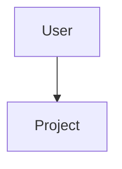
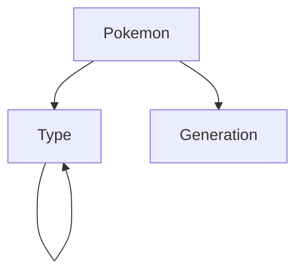



# Prática CBD - 4

# Index
- [Initial Configurations](#initial-configurations)
- [Initial Neo4j Interactions](#initial-neo4j-interactions)
- [Neo4j - Movie Graph](#neo4j---movie-graph)
- [Neo4j -  Projects and Programmers Network](#neo4j---projects-and-programmers-network)
- [Free Theme DB](#free-theme-db)

# Initial Configurations
Checkout https://neo4j.com/download/ download and install.
You'll find an in-depth installation guide after the download starts

### Creating a Neo4j Alias
In case you want to be able to run Neo4j by simply typing 'neo4j' follow the next steps:
1. Create a new directory /usr/local/neo4j
2. Move the file you downloaded to this directory
3. Navigate to your home folder ($cd ~)
4. Edit the hidden .bashrc file ($vim .bashrc)
5. Add the following line: `alias neo4j='/usr/local/neo4j/neo4j-desktop-offline-1.2.3-x86_64.AppImage'`
6. Save and exit the file editing
7. Run the following command: `$. ~/.bashrc`

You should now be able to start the Neo4j Desktop app by simply typing:
`$ neo4j`

# Initial Neo4j Interactions
For more information visit https://neo4j.com/developer/get-started/

## Graph Databases
Neo4j is an example of the implementation of a Graph Database. In short, these databases are designed to treat the relationships between data as equally important data (i.e the information is as important as the relations that connect it).
The data is stored like we first draw it out showcasing how each individual entity connects with or is related to others.

## Data Model
### Nodes
Nodes are the entities in the graph. They hold any number of key-value pairs (i.e attributes) which we call **Properties**.
We can tag nodes with **labels** representing their different roles in our domain. Labels can also be used to attach metadata (like index or constraint information to certain nodes)

### Relationships
Relationships provide direct, named, semantically relevant connections between two node entities.
A relationship is caracterized by having:
-	**Direction**
-	**Type**
-	**Start Node**
-	**End Node**
Relationships, like nodes, can also have properties such as **weights**, **costs**, **distances**, **ratings**, **time intervals** or **strengths**.
Two nodes can share any number or type of relationships and despite being stored in a specific direction, they can be navigated efficiently in any direction


## Neo4j Usage - Setup
### Creating a Project
On the app's starting page click `+ New`
To **rename** the newly created project click on it and on right pane hover over it's name and click on the pencil

### Creating a Database
After selecting a project simply click on `Add Graph` and then on `Create a Local Graph`
You'll have to name and create a password for your database. 
Note: 

> Please remember your database password. If you forget it, you will have to remove the credentials file in `data/dbms/authorization`.

### Working with a Graph
After creating a database click `Manage` and then `Open in Browser`
Inside the Neo4j Browser you'll now be able to populate and query your graph by inputting Cypher - Neo4j's query language - commands.


## Neo4j Usage - Populating Graphs

For a more in-depth explanation, visit https://neo4j.com/docs/cypher-manual/current/clauses/create/

### Creating Nodes
Cypher's syntax for node creation is as follows:
```
//Creates a single node, n
CREATE (n)

//Creates a single node, n with the label Person
CREATE (n:<Tag>)		

//Creates a single node, n with the labels Person and Teamleader
CREATE (n:<Tag 1>:<Tag 2>)	

//Creates a single node, n with the label Person and properties name and role
CREATE (n: <Tag> {<Property 1>: <Value 1>, <Property 2>: <Value 2>, ...})	

//Creates two nodes, n and m
CREATE (n), (m)			
```

Here are some examples of node insertion:


### Creating Relationships
Cypher's syntax for relationship creation is as follows:
```
MATCH <node 1>, <node 2>
WHERE <match condition>
CREATE <starting node>-[r:<relationshp name> {<relationship properties>}]-><ending node>
RETURN <return parameters>
```

Let's connect all nodes we created on the previous subsection:
```
MATCH (a:Pirocanhoes),(b:Pirocanhoes)
WHERE a.name <> b.name
CREATE (a)-[r:Teammate { type:  'Plays with' }]->(b)
RETURN (a), (b)
```


```
MATCH (a:Pirocanhoes),(b:Pirocanhoes)
WHERE a.role = 'IGL' AND a.name <> b.name
CREATE (a)-[r:Teammate { type:  'Leads' }]->(b)
RETURN (a), (b)
```


### Creating a Full Path
You can use a CREATE query to create both the nodes and the relationships all at once. The following query makes it so all patterns that are not already inside the scope will be created
```
CREATE p =(<starting node> { <node properties> })-[r:<relationship name> { <relationship properties> }]-(<ending node> { <node properties>})
RETURN p
```

As an example, you have:
```
MATCH (b:Pirocanhoes)
CREATE p =(pedro:Member:Pirocanhoes { name:'Fagottini', role: 'Manager' })-[r:TeamMember {type: 'Manager' }]->(b)
RETURN p
```


### Deleting Nodes
On the last example we kinda effed up and ended up creating 4 of the same nodes when all we wanted was to create 1 node and connect it to all the others. So let's revert this and delete those nodes.
This can be accomplished with the command:
```
MATCH (<node> { <parameter 1>: <value 1>, ...})
DETACH DELETE n
```

As an example, you have:
```
MATCH (n { name:"Fagottini"})
WHERE ID(n) > 1
DETACH DELETE n
```


### Deleting Relationships
Besides deleting both Nodes and Relationships, you can choose to delete just the relationship with the following command:
```
MATCH (<starting node> { <starting node param 1>: <starting node value 1>, ... })-[<relationship>:<relationship name> {<relationship properties>}]-><ending node or ()>
DELETE r
```

As an example, you have:
```
MATCH (n { name:"Fagottini"})-[r:TeamMember]->()
DELETE r
```


# Neo4j - Movie Graph
## Setup
1. Create a new project and database such that your setup looks like this:

	
2. After starting the DB go into the Neo4j Browser and input the command `:play movie-graph`

	
3. Follow the instructions in the text block that showed up after the last command

At the end, your graph should look like this:


## Queries
```
#1
// Encontre todos os atores que dirigiram um filme em que também atuaram e
apresente o nome do ator e o título do filme.

MATCH(actor) -[:DIRECTED] -> (movie) <- [:ACTED_IN] - (actor) 
RETURN DISTINCT actor.name as name, movie.title as title
//NOTE: Added the Distinct clause that "retrieves only unique rows depending on the columns that have been selected to output.". This was done due to performance and because we're not interested in having the same name-title row appear more than once

#2
// Para cada filme realizado depois de 2005, apresente os nomes de todos os atores
que atuaram nesse filme.

MATCH(actor) -[:ACTED_IN] -> (movie) 
WHERE movie.released > 2005
WITH movie, COLLECT(actor) as movie_actors
RETURN movie, movie_actors
//NOTE: We added the COLLECT aggregation function in order to be able to present the information in the form of Movie - List of actors in the movie. Note that "COLLECT collects values into a list (a real list that you can run list operations on)"

#3 
// Encontre pares de nós com mais do que uma relação entre si.

MATCH (n)-[r]->(m) 
WITH n,m, count(r) as rel_count
WHERE rel_count > 1
RETURN n,m

#4
// Encontre todos os pares de pessoas que fizeram revisões do mesmo filme.
Apresente os seus nomes e título de cada filme.

MATCH (reviewer1)-[:REVIEWED]->(movie)<-[:REVIEWED]-(reviewer2) 
WHERE ID(reviewer1) > ID(reviewer2)
RETURN reviewer1.name,reviewer2.name, movie.title

#5
// Encontre todos os pares de atores que atuaram em vários filmes juntos.

MATCH (actor1)-[:ACTED_IN]->(movie)<-[:ACTED_IN]-(actor2) 
WITH actor1,actor2, count(movie) as movie_count
WHERE movie_count > 1 and ID(actor1) > ID(actor2)
RETURN actor1,actor2

#6
// Determine a idade média do elenco do filme "Apollo 13" no ano do lançamento
do filme.

MATCH (actor)-[r:ACTED_IN]->(movie {title:"Apollo 13"})
WITH date.realtime().year - round(avg(actor.born)) as avg_age
RETURN avg_age

#7
// Encontre os 10 filmes com o elenco mais velho no momento do lançamento do
filme. Apresente o filme e a idade média arredondada a 2 casas decimais, por
ordem decrescente.

MATCH (actor)-[r:ACTED_IN]->(movie)
WITH movie, movie.released - avg(actor.born) as avg_age
RETURN movie.title, round(avg_age*100)/100
ORDER BY avg_age DESC
LIMIT 10

#8
// Apresente o subgrafo ACTED_IN do filme com o elenco mais novo, no momento
do lançamento do filme.

MATCH (actor)-[r:ACTED_IN]->(movie)
WITH movie as youngest_movie, movie.released - avg(actor.born) as avg_age
ORDER BY avg_age
LIMIT 1

MATCH (actor)-[r:ACTED_IN]->(youngest_movie)
RETURN youngest_movie, actor
ORDER BY avg_age

#9
// Qual é o caminho mais curto (usando qualquer tipo de relação) entre John
Cusack e Demi Moore?

MATCH path=shortestPath(
  (start_node {name:"John Cusack"})-[*]-(end_node {name:"Demi Moore"})
)
RETURN path

#10
// Qual a dimensão caminho mais curto (usando qualquer tipo de relação) entre
Keanu Reeves e Tom Cruise?

MATCH path=shortestPath(
  (start_node:Person {name:"Keanu Reeves"})-[*]-(end_node:Person {name:"Tom Cruise"})
)
UNWIND nodes(path) as n
RETURN COUNT(DISTINCT n);

#11
// Quais são a dimensão do caminho mais curto entre pessoas com nome Jim e
pessoas com nome Kevin?

MATCH path=shortestPath(
  (start_node:Person)-[*]-(end_node:Person)
)
WHERE start_node.name CONTAINS 'Jim' and end_node.name CONTAINS 'Kevin'
UNWIND nodes(path) as n
WITH path, COUNT(DISTINCT n) as dimension
ORDER BY dimension
LIMIT 1
RETURN dimension

#12
// Que pessoas têm uma distância 2 para Jim Cash (a distância entre duas pessoas é
o comprimento do caminho mais curto entre eles)?

MATCH path=shortestPath(
  (start_node:Person)-[*]-(end_node:Person {name:"Jim Cash"})
)
WHERE start_node <> end_node
UNWIND nodes(path) as n
WITH start_node, path, COUNT(DISTINCT n) as dimension
WHERE dimension = 2
RETURN start_node

#13
// Qual é a maior distância de uma pessoa para Kevin Bacon?

MATCH path=shortestPath(
  (start_node:Person)-[*]-(end_node:Person {name:"Kevin Bacon"})
)
WHERE start_node <> end_node
UNWIND nodes(path) as n
WITH start_node, path, COUNT(DISTINCT n) as dimension
ORDER BY dimension DESC
LIMIT 1
RETURN dimension

#14
// Qual é a maior distância entre duas pessoas?

MATCH path=shortestPath(
  (start_node:Person)-[*]-(end_node:Person)
)
WHERE start_node <> end_node
UNWIND nodes(path) as n
WITH start_node, path, COUNT(DISTINCT n) as dimension
ORDER BY dimension DESC
LIMIT 1
RETURN dimension

#15
// Qual é a distribuição de distâncias em pares (isto é, para a distância 1, 2, 3, ..., quantos pares de pessoas têm essa distância um do outro)?

MATCH path=shortestPath(
  (start_node:Person)-[*]-(end_node:Person)
)
WHERE start_node <> end_node
UNWIND nodes(path) as n
WITH start_node, path, COUNT(DISTINCT n) as dimension
ORDER BY dimension
RETURN dimension, count(dimension)

#16
// Indique as 10 pessoas com menor distância média em que o caminho entre elas
são relações do tipo ACTED_IN.

MATCH path=shortestPath(
  (start_node:Person)-[:ACTED_IN*]-(end_node:Person)
)
WHERE start_node <> end_node
UNWIND nodes(path) as n
WITH start_node, path, COUNT(DISTINCT n) as dimension
RETURN start_node, avg(dimension) as average
ORDER BY average
LIMIT 10
```

# Neo4j -  Projects and Programmers Network
## Setup
1.	Model how the database is gonna look like. E.g:

**User**: *svn_id* , *real_name* , *organization*
**Project**: *name*
Relationship **Commited** (User->Project): *num* , *role_on_project*

2. Create a new project and database such that your setup looks like this:


3.	Click `Manage` on the database section and then `Open Folder`


4.	Copy the git_selection.csv file over to the `import` folder


5.	Start the database and open the neo4j browser
6.	Create the following constraints:
```
CREATE CONSTRAINT ON (project:Project) ASSERT project.project_name IS UNIQUE
CREATE CONSTRAINT ON (user:Member) ASSERT user.svn_id IS UNIQUE
```
7.	Create the following Cypher Query in order to create the graph's **nodes**:
```
LOAD CSV WITH HEADERS
FROM "file:///git_selection.csv"
AS Row

MERGE (user:Member {svn_id: Row.svn_id})
SET user.real_name=Row.real_name, user.organization=Row.organization

MERGE (project:Project {project_name: Row.project_name})
```

8.	Create the following Cypher Query in order to create the graph's **relationships**:
```
LOAD CSV WITH HEADERS
FROM "file:///git_selection.csv"
AS Row

MATCH (user:Member {svn_id: Row.svn_id}),(project:Project {project_name:Row.project_name})
CREATE (user)-[:COMMITED {num: Row.num, role_on_project: Row.role_on_project}]->(project)
```

In the end you should have a graph that looks something like this:

## Queries
```
#1
// Liste a informação de cada utilizador.

MATCH (user:Member)
RETURN user


#2
// Liste o nome de cada utilizador.

MATCH (user:Member)
RETURN user.real_name


#3
// Liste a informação de cada projeto, no qual tenha participado pelo menos
um utilizador.

MATCH ()-[r:COMMITED]->(project:Project)
WITH project, count(r) as rel_counter
WHERE rel_counter >= 1
RETURN project


#4
// Liste os utilizadores e total de projetos em que cada um colabora.

MATCH (user:Member)-[r:COMMITED]->()
WITH user, count(r) as rel_counter
RETURN user,rel_counter


#5
// Liste os utilizadores e do total de projetos em que cada colabora ordenados
por ordem decrescente do total.

MATCH (user:Member)-[r:COMMITED]->()
WITH user, count(r) as rel_counter
RETURN user,rel_counter
ORDER BY rel_counter DESC


#6
// Liste projetos e total de membros em cada projeto.

MATCH ()-[r:COMMITED]->(project:Project)
WITH project, count(r) as rel_counter
RETURN project, rel_counter


#7
// Liste projetos e total de membros com a role "Committer" em cada projeto.

MATCH ()-[r:COMMITED]->(project:Project)
WITH project, count(r.role_on_project = "Committer") as rel_counter
RETURN project, rel_counter

#8
// Liste todos os utilizadores que participaram nos mesmo projetos do que o
utilizador "atm" (id). Mostre os atributos: nome de "atm", nome utilizador
2, nome do projeto.

MATCH (atm:Member {svn_id:"atm"})-[:COMMITED]->(project:Project)<-[:COMMITED]-(user:Member)
RETURN atm.real_name, user.real_name, project.project_name


#9
// Liste todos os utilizadores que participaram com a role "Committer" em
projetos em que o utilizador "atm" (id1) participou com a role "PMC".

MATCH (atm:Member {svn_id:"atm"})-[:COMMITED {role_on_project: "PMC"}]->(project:Project)<-[:COMMITED {role_on_project: "Committer"}]-(user:Member)
RETURN user
```

# Free Theme DB
## Setup - Python Driver
https://neo4j.com/developer/python/

## The Pokémon Dataset
For this exercise I chose to use the Pokemon Pokedéx Dataset, downloadable at https://gist.github.com/armgilles/194bcff35001e7eb53a2a8b441e8b2c6#file-pokemon-csv. 

The model chosen to represent the data was drawn like so:

**Pokemon**: *name* , *HP* , *Attack*, *Sp. Attack*, *Defense*, *Sp. Defense*, *Speed*

**Type**: *type_name*

**Generation**: *generation_no*
Relationship **Type** (Pokemon->Type) 

Relationship **From** (Pokemon->Generation) 

Relationshiop **Weak** (Type->Type)

Relationship **Strong** (Type->Type)


## Setup
1.	Download the dataset
2.	Create a new Project and Database (set the password to `pokemon`
3.	Start the Database
4.	Put the dataset in the import folder of the database (see last section)

## Connecting to our server and database
Initially, this is what the code should look like
```
from neo4j import GraphDatabase

class  PokemonGraphController(object):
  
	def  __init__(self, uri, user, password):
		self._driver = GraphDatabase.driver(uri, auth=(user, password))

  

	def  close(self):
		self._driver.close()

  
if  __name__ == "__main__":
	controller = PokemonGraphController(
		"bolt://localhost:7687", "neo4j", "pokemon")
	controller.close()
```
Note how we used **neo4j** for our user (the default user) and **pokemon** as a password (since it was the one we set when we created the db)

## Inserting data from our CSV
To insert data, your code should look something like this:
```
from neo4j import GraphDatabase

class  PokemonGraphController(object): 

	def  __init__(self, uri, user, password):
		self._driver = GraphDatabase.driver(uri, auth=(user, password))

	def  close(self):
		self._driver.close()  

	def  insert_data(self):
		self.insert_nodes()
		self.insert_relations()  

	def  insert_nodes(self):

		with  self._driver.session() as session:
			#Nodes
			
			print("Inserting Pokemon")
			session.run(
				"LOAD CSV WITH HEADERS FROM 'file:///pokemon.csv' AS Row MERGE (pokemon:Pokemon {name: Row.Name}) SET pokemon.number=Row.Entry, pokemon.total=Row.Total, pokemon.hp=Row.HP, pokemon.attack=Row.Attack, pokemon.defense=Row.Defense, pokemon.spatk=Row.Sp.Atk, pokemon.spdef=Row.Sp.Def, pokemon.speed=Row.Speed")

			print("Inserting Generations")
			session.run(
				"LOAD CSV WITH HEADERS FROM 'file:///pokemon.csv' AS Row MERGE (generation:Generation {number: Row.Generation})")
		
			print("Inserting Type 1")
			session.run(
				"LOAD CSV WITH HEADERS FROM 'file:///pokemon.csv' AS Row MERGE (tipo:Type {type: Row.Type1})")

			print("Inserting Type 2")
			session.run(
				"LOAD CSV WITH HEADERS FROM 'file:///pokemon.csv' AS Row WITH Row WHERE NOT Row.Type2 IS null MERGE (tipo:Type {type: Row.Type2})")  

	def  insert_relations(self):

		with  self._driver.session() as session:
			#Relationships

			print("\nInserting Pokemon-Generation Relationships")
			session.run(
				"LOAD CSV WITH HEADERS FROM 'file:///pokemon.csv' AS Row MATCH(pokemon:Pokemon {name: Row.Name}),(generation:Generation {number: Row.Generation}) CREATE (pokemon)-[:GEN]->(generation)")

			print("Inserting Pokemon-Type1 Relationships")
			session.run(
				"LOAD CSV WITH HEADERS FROM 'file:///pokemon.csv' AS Row MATCH(pokemon:Pokemon {name: Row.Name}),(type:Type {type: Row.Type1}) CREATE (pokemon)-[:Type]->(type)")

			print("Inserting Pokemon-Type2 Relationships")
			session.run(
				"LOAD CSV WITH HEADERS FROM 'file:///pokemon.csv' AS Row WITH Row WHERE NOT Row.Type2 IS null MATCH(pokemon:Pokemon {name: Row.Name}),(type:Type {type: Row.Type2}) CREATE (pokemon)-[:Type]->(type)")
			
			print("Inserting Pokemon-type Weaknesses")
			session.run(
				"LOAD CSV WITH HEADERS FROM 'file:///pokemon_type_weakness.csv' AS Row WITH Row MATCH(attacker:Type {type: Row.Attacker}),(defender:Type {type: Row.Defender}) CREATE (attacker)-[:WEAK_AGAINST]->(defender)")
			
			print("Inserting Pokemon-type Strength")
			session.run(
				"LOAD CSV WITH HEADERS FROM 'file:///pokemon_type_strength.csv' AS Row WITH Row MATCH(attacker:Type {type: Row.Attacker}),(defender:Type {type: Row.Defender}) CREATE (attacker)-[:STRONG_AGAINST]->(defender)")

			  
			print("Inserting Pokemon-type Immunities")
			session.run(
				"LOAD CSV WITH HEADERS FROM 'file:///pokemon_type_immune.csv' AS Row WITH Row MATCH(attacker:Type {type: Row.Attacker}),(defender:Type {type: Row.Defender}) CREATE (defender)-[:IMMUNE_AGAINST]->(attacker)")

  
if  __name__ == "__main__":
	controller = PokemonGraphController(
		"bolt://localhost:7687", "neo4j", "pokemon")
	controller.insert_data()
	controller.close()
```

**Note** how we also have 3 aditional CSV's that (pokemon_type_xxx) that are used to create Weakness,Strenght and Immunity relationships between the pokemon types. These CSVs were created using a custom script (that can be found in the directory). These CSV's should (obviously) also be included in the Import folder of the Database

## Queries
```
if  __name__ == "__main__":

	controller = PokemonGraphController(

	"bolt://localhost:7687", "neo4j", "pokemon")
	
	#controller.insert_data()

	counter = 1	  

	query_list = ["MATCH (n:Type) RETURN n",

	"MATCH(poke:Pokemon)-[:Type]->(:Type {type:\"Dragon\"}) MATCH(poke)-[:GEN]->(:Generation {number:\"1\"}) WHERE toInt(poke.attack) > 80 return poke",

	"MATCH(poke:Pokemon)-[:Type]->(:Type {type:\"Steel\"}) RETURN poke ORDER BY poke.HP DESC LIMIT 1",

	"MATCH(poke:Pokemon) RETURN poke ORDER BY poke.speed LIMIT 3",

	"MATCH(poke:Pokemon)-[:Type]->(:Type {type:\"Psychic\"}) MATCH(poke)-[:Type]->(:Type{type:\"Fire\"}) MATCH(poke)-[:GEN]->(:Generation{number:\"5\"}) return poke",

	"MATCH(immune:Type)-[:IMMUNE_AGAINST]->(attacker:Type{type:\"Ghost\"}) return immune",

	"MATCH(lucario:Pokemon{name:\"Lucario\"})-[:Type]->(lucario_types:Type) MATCH(lucario_types:Type)-[:STRONG_AGAINST]->(types:Type) RETURN types",

	"MATCH(gyarados:Pokemon{name:\"Gyarados\"})-[:Type]->(gyarados_type:Type) MATCH(gyarados_type:Type)-[:WEAK_AGAINST]->(types:Type) MATCH(pokemon:Pokemon)-[:Type]->(types) WITH COUNT(pokemon) AS counter RETURN counter",

	"MATCH(pokemon:Pokemon)-[:Type]->(:Type{type:\"Fighting\"}) MATCH(pokemon)-[:Type]->(types:Type) MATCH(types)-[:WEAK_AGAINST]->(:Type{type:\"Water\"}) RETURN pokemon",

	"MATCH(pokemon:Pokemon) WHERE(pokemon.name ENDS WITH 'chu') RETURN pokemon"]

	query_verbose = ["Get all Pokemon Types in the database",

	"Get all Dragon Type Pokemons from the first generation that have over 80 attack",

	"Get the Steel Pokemon with the Highest HP",

	"Get the 3 Pokemon with the lowest speed",

	"Get all Psychich type Pokemon from the 5th Generation that are also Fire type",

	"Get all Pokemons immune to Ghost Type",

	"Get all Pokemons that Lucario is Strong Against",

	"Get how many Pokemons that Gyarados is weak against",

	"List all Fighting Type Pokemon that are Weak against Water",

	"List all Pokemon whose name ends with \"chu\""]

	with  open("../CBD_L44c_output.txt", "w") as writer:

		for current_query in query_list:
			query = current_query
			writer.write("Query " + str(counter) + ": " + query_verbose[counter-1]+"\n")
			writer.write(" " + current_query +"\n")
		  
			counter += 1

			query_result = controller.query_builder(query)

			for i in query_result:
				print(i.items()[0][1])
				writer.write(" " + str(i.items()[0][1]) + "\n")
			writer.write("\n\n")
```

# Author
### Diogo Silva, 89348
